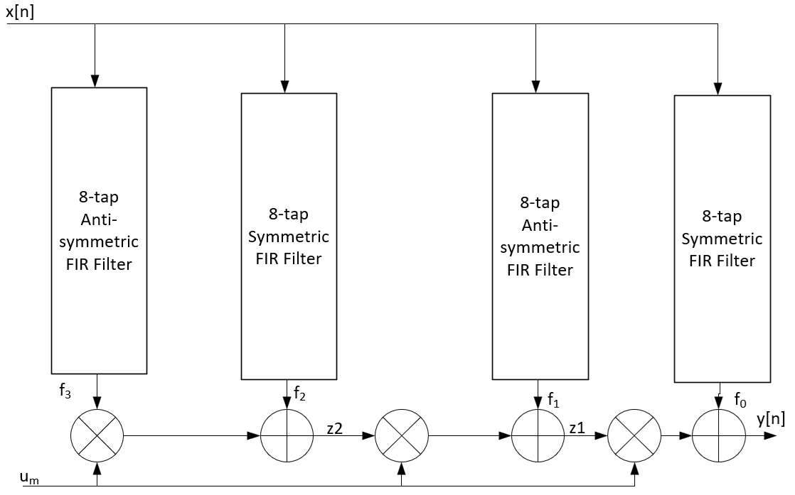
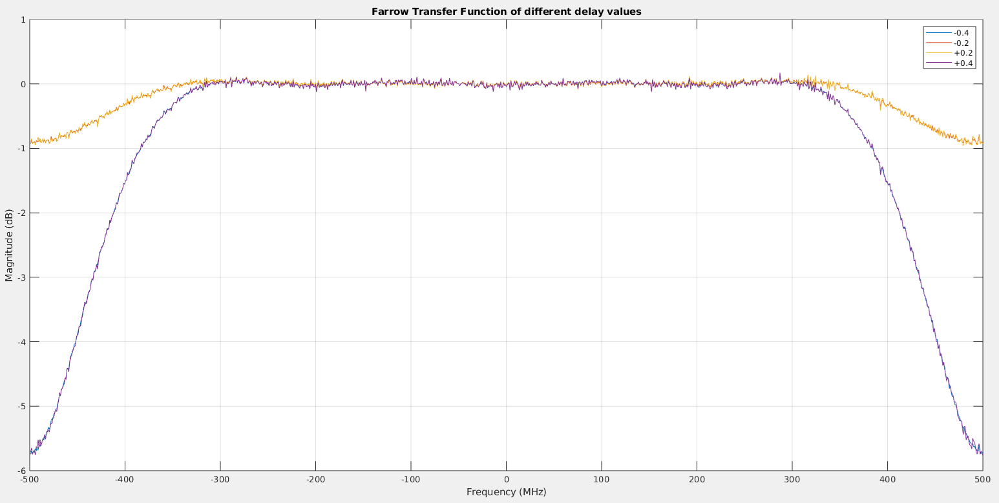
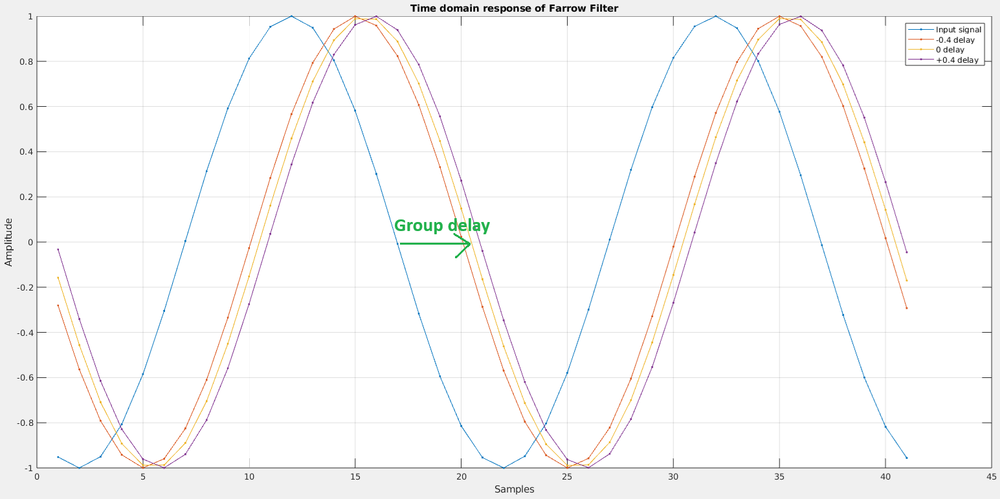
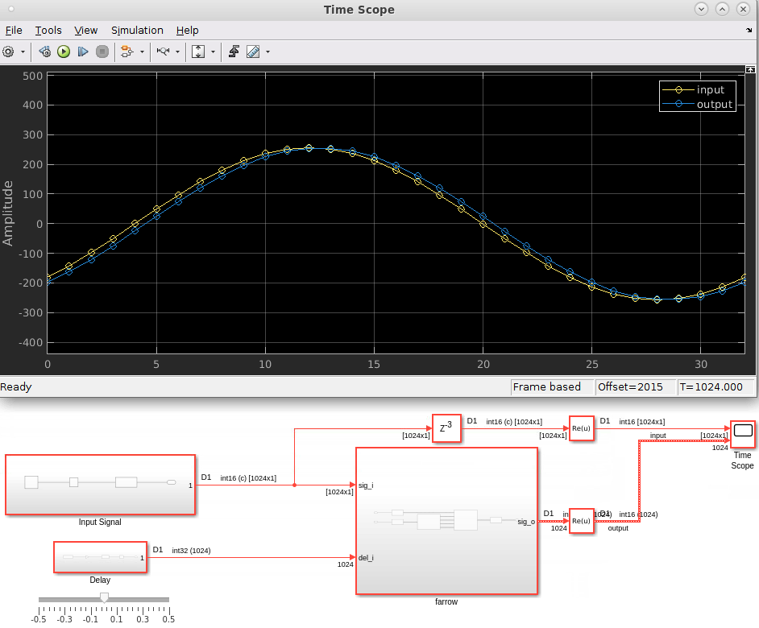
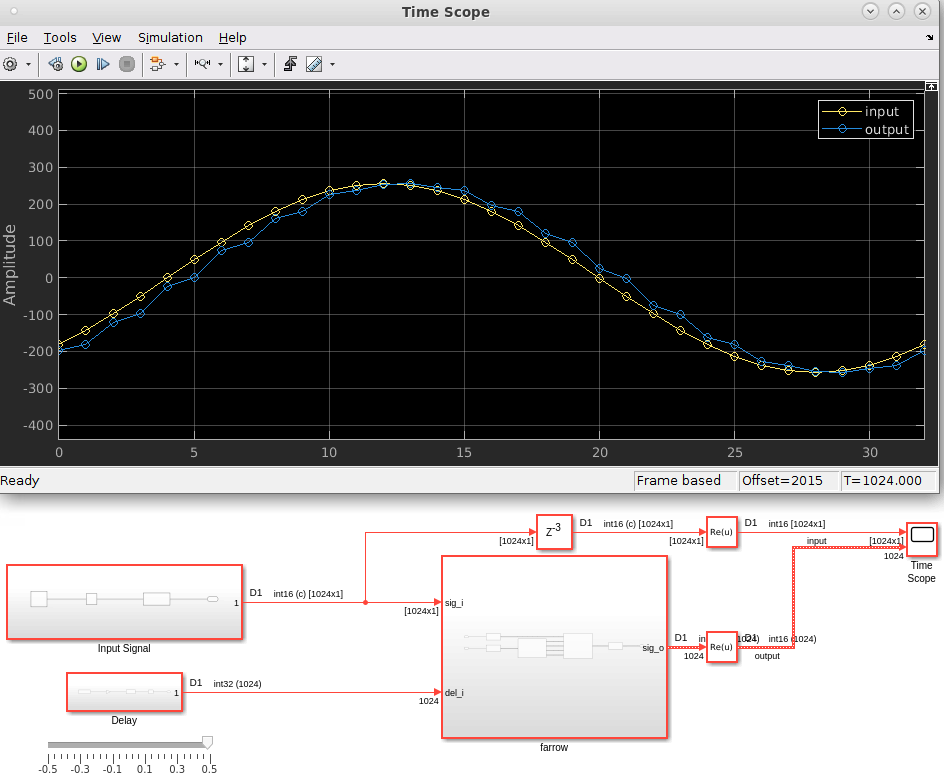
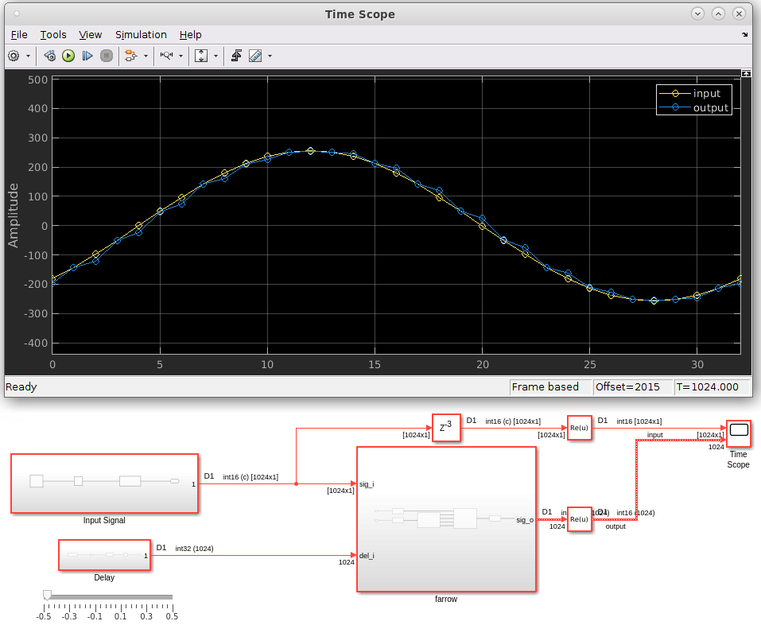
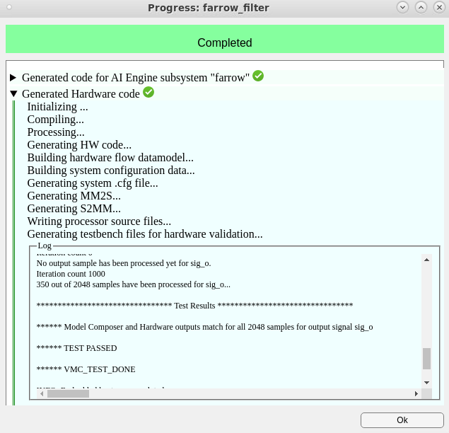

# Fractional Delay Farrow Filter

This example demonstrates a Vitis Model Composer testbench for a fractional delay Farrow filter, implemented on AI Engines.

## Introduction

A fractional delay filter is a common digital signal processing (DSP) algorithm found in many applications including digital receivers in modems and is required for timing synchronization.
Assuming you have a signal `x` sampled uniformly with a sampling frequency `Fs` (samples per second), this means samples exist at `x(n*Ts)` where `Ts=1/Fs` and `n` is an integer. Because the receiver timing is initially unknown, demodulating the signal at these intervals can result in inter-symbol interference due to samples not landing in the middle of the eye diagram.
This introduces the need for a fractional delay filter so samples can be produced at `x(n*Ts + u*Ts)` where `-0.5 < u < 0.5` is the unknown fractional delay parameter to be identified at the receiver. In some cases, this fractional delay is time-varying, for example, as `u(n*Ts)`, and so the time-recovered signal can be given as `x(n*Ts + u(n*Ts) * Ts)`. 

Reference [[1]] provides some background on timing recovery in such systems. An efficient realization of a continuously variable fractional delay filter is shown by C. W. Farrow in [[2]].

## Design Overview

We implement the 3rd order Farrow filter depicted in the following figure.

*Figure 1 - Farrow Filter with Polynomial Order p = 3*

More details on the Farrow filter design for AI Engines can be found in the [Vitis-Tutorials](https://github.com/Xilinx/Vitis-Tutorials/tree/2024.1/AI_Engine_Development/AIE/Design_Tutorials/15-farrow_filter) repository.

The Farrow filter complies with the following requirements:

|Requirements| |
|---|---|
| Sampling rate | 1 Gsps |
| I/O data type | `cint16` |
| Coefficients data type | `int16` |
| Delay input data type | `int16` |

The filter achieves the following frequency and time domain responses.

*Figure 2 - Farrow Filter with Polynomial Order p = 3 - Frequency Response*

*Figure 3 - Farrow Filter with Polynomial Order p = 3 - Time Domain Response*

The MATLAB script `study_farrow.m` to design the filter and produce these plots is provided for your reference.

## Simulink Model

The Simulink model contains a testbench that provides input to the Farrow filter and compares it to the output.

The DUT (AI Engine subsystem **farrow**) has two inputs. The first input is the signal to be filtered, and the second input is the fractional delay (-0.5 to 0.5). A slider allows you to change the fractional delay while the simulation is running. (The **Delay** subsystem converts the delay value to an `int32` for input to the DUT.)

You can use any MATLAB code or Simulink blocks you want to generate input stimulus. In this design, the input consists a sine wave with data type `cint16`.

### AI Engine Model

The AI Engine model consists of two imported AIE Class Kernels. The 64-bit PLIO blocks on each input and output mean that 2 `cint16` samples are transferred to and from the AI Engine on each clock cycle.

The first kernel implements computes the four filter outputs (`y0`, `y1`, `y2`, `y3`) depicted in Figure 1 above. The second kernel computes the intermediate outputs `z1` and `z2` and the final output `y`.

## Simulation Results

The nominal delay of the Farrow filter is approximately 3.5 samples. This is accounted for in the testbench with the `z^(-3)` delay placed on the input signal. When we run the testbench with delay = 0, we see a subsample delay between input and output.

Setting the delay to -0.5 or +0.5 produces the corresponding effect in the output signal.

Delay = +0.5:

Delay = -0.5:

## Hardware Validation

Using the **Validate on Hardware** tab of the **Vitis Model Composer Hub** block, the filter design can be validated on the VCK190 hardware or hardware emulation.

## References

[1]:<https://ieeexplore.ieee.org/document/221081>
[[1]]: F. M. Gardner, "Interpolation in digital modems. I. Fundamentals," in IEEE Transactions on Communications, vol. 41, no. 3, pp. 501-507, March 1993, doi: 10.1109/26.221081.

[2]:<https://ieeexplore.ieee.org/document/15483>
[[2]]: C. W. Farrow, "A continuously variable digital delay element," 1988., IEEE International Symposium on Circuits and Systems, Espoo, Finland, 1988, pp. 2641-2645 vol.3, doi: 10.1109/ISCAS.1988.15483.

------------

Copyright (c) 2024 Advanced Micro Devices, Inc.
