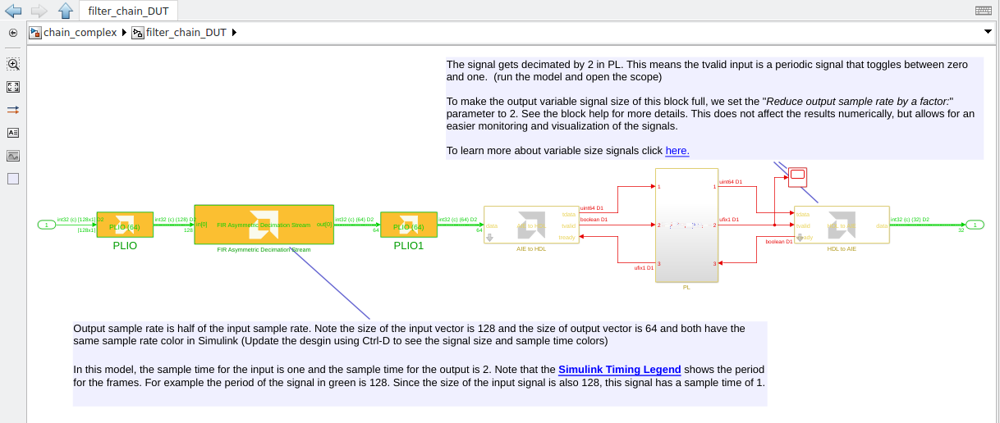
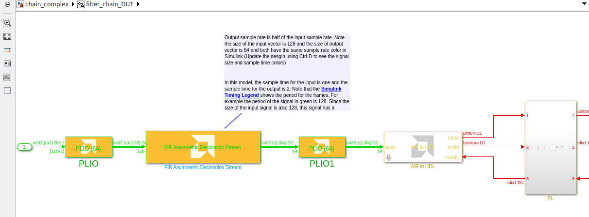
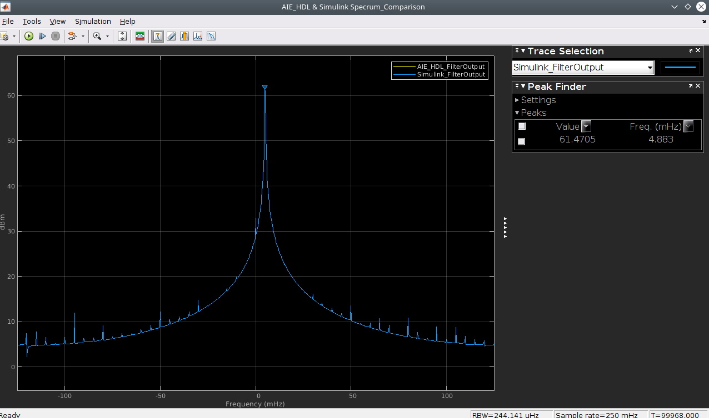

# Multirate Filter Chain Example model using both AI Engines and Programmable Logic (HDL)

In this section we showcase a Multirate Filter Chain design using both AI Engines and Programmable Logic.

## Knowledge Nuggets

:bulb: _AIE to HDL_ blocks are needed for connectivity between AIE blocks and HDL blocks. 

:bulb: Take care to set the AI Engine sample time, PL Gateway block sample period, and the Simulink system period in the Model Composer Hub block to match the multirate behavior of your system.

## Introduction

This example consists of two decimation filters. The first is implemented in the AI Engine, and the second is implemented in PL.

## Simulink Model

Open the example design `chain_complex.slx` and note the key elements explained below.

### Input Sources

Two simulation sources generate stimulus for simulation. A manual switch toggles between a random signal source and a sinusoidal signal. Both sources have a sample period of 1 second and vector size of 128.

### Combined AIE/PL Subsystem

The subsystem to be implemented on hardware consists of an AI Engine subsystem and a PL subsystem. Refer to the figure below to see how the **AIE to HDL** and **HDL to AIE** blocks are configured based on the sample rates in the model.

### AI Engine Subsystem

A **FIR Asymmetric Decimation Stream** block (with decimation factor 2) is placed between the input source and the PL subsystem.

### PL Subsystem

According to above example design, the input sample period to the PL subsystem should be `(Input source sample period) * (Decimation Factor of AIE Asymmetric Decimation Stream)`.

Because the input source sample period is 1 and the decimation factor of the AIE FIR is 2, set the sample time in the Gateway In AXIS block inside the PL subsystem to 2.

**NOTE:** In the Hub block for the PL subsystem, we set the Simulink system period to 2 to match the input sample time for the PL subsystem.

#### FIR Compiler 7.2 Block

The FIR Compiler block needs to be configured as follows to implement a filter with a decimation factor of 2.

On the **Filter Specification** tab, set the **Decimation Rate Value** to 2.

On the **Channel Specification** tab, set the following:

* **Number Of Paths:** `2` (Two paths are selected for complex data. One path is for In-phase data; the other is for Quadrature data.)
* **Select Format:** `Input_Sample_Period` (When Input Sample Period is selected, you can specify the number of clock cycles between input samples.)
* **Sample Period:** `1` (Number of clock cycles between input or output samples).

### Simulink Filter Chain Subsystem

In the Simulink golden reference design, two FIR decimation filters, each with decimation factor 2, are cascaded.

## Results

Output spectrum when input is complex random source:

Output spectrum when input is complex sinusoidal signal:

------------

Copyright (c) 2024 Advanced Micro Devices, Inc.

