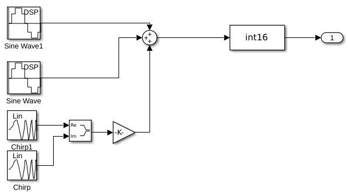

# Prime Factor FFT-1008 on AIE-ML

This example demonstrates a Prime Factor FFT algorithm on AIE-ML devices. It demonstrates the **Shared Buffer** block to access Memory Tiles on the AIE-ML array.

## Introduction
The Prime Factor Algorithm (PFA) [[1]] is a Fast Fourier Transform (FFT) algorithm [[2]] discovered by Good & Thomas before the more popular Cooley-Tukey algorithm with some interesting properties. The PFA is another "divide and conquer" approach for computing a Discrete Fourier Transform (DFT) of size `N = N1 * N2` as a two-dimensional DFT of size `N1 X N2` as long as `N1` and `N2` are relatively prime (ie. share no common divisors). The smaller transforms of size `N1` and `N2` may be computed by some other technique, for example using the Winograd FFT Algorithm, or the PFA technique may be applied recursively again to both `N1` and `N2`. It turns out Versal AI Engines compute DFT with small dimensions `N < 32` very efficiently using direct vector/matrix multiplication. Consequently, the PFA approach using DFT on the individual prime factors provides an efficient approach to the FFT on Versal AI Engines.

A second advantage of the PFA approach is that unlike the popular Cooley-Tukey FFT, no extra multiplications by "twiddle factors" need be performed between stages. This fact falls out of the DFT factorization when `N1` and `N2` share no common factors. This provides a computational advantage compared to the more traditional Cooley-Tukey formulation, but the PFA incurs a drawback in that a complicated re-indexing or permutation of it's I/O samples is required. For Versal devices with both AI Engines and Programmable Logic (PL), however, this drawback is solved easily by leveraging the PL to implement these permutations as part of a custom data flow tailored to the PFA signal flow graph.

An [earlier tutorial](https://github.com/Xilinx/Vitis-Tutorials/tree/2024.1/AI_Engine_Development/AIE/Design_Tutorials/05-Prime-Factor-FFT) implemented a PFA-1008 transform on AIE architecture in the VC1902 device. This tutorial maps the PFA-1008 transform to AIE-ML architecture in the VE2802 device. Once again we map the short-length DFT-7, DFT-9 and DFT-16 transforms to AI Engine using vector-matrix DFT's but this time to the AIE-ML architecture. The intermediate "memory transpose" operations mapped earlier to the programmable logic (PL) are instead mapped here to the Memory Tiles contained in the AIE-ML array. This simplifies data flow and keeps most of the graph inside the the array. The input and output permutation blocks remain implemented in the PL as RTL obtained using VItis High Level Synthesis (HLS) from untimed C++ models. These cannot be mapped to Mem Tiles as they require a type of modulo addressing not supported by the Memory Tile buffer descriptors (BDs).

## Design Overview

The figure below shows a block diagram of a 3D PFA-1008 hardware design implemented in Versal using AI Engines and PL. The design targets a 1 Gsps throughput (SSR=1). AI Engines implement the three DFT kernels, specifically DFT-7, DFT-9 and DFT-16, using a vector-matrix multiplication approach. The design implements the matrix transpose kernels in the AI Engine array using Memory Tiles, and maps the I/O permutation blocks to PL using Vitis HLS.

More details on each kernel design, as well as MATLAB models for the same, can be found in the [Vitis-Tutorials](https://github.com/Xilinx/Vitis-Tutorials/tree/2024.1/AI_Engine_Development/AIE-ML/Design_Tutorials/02-Prime-Factor-FFT) repository.

## Simulink Model

The Simulink model contains a testbench that provides input to the Prime Factor FFT algorithm and displays the output.

You can use any MATLAB code or Simulink blocks you want to generate input stimulus. In this design, the input consists of two tones (sine waves) and a linear frequency sweep.

The DUT itself consists of the AI Engine design, with HLS Kernels on the input and the output. The HLS Kernels perform the input and output permute operations, as depicted in the block diagram in the Design section above, in the PL.

The AI Engine design contains subsystems for each of the DFTs (DFT-7, DFT-9 and DFT-16). The `Transpose0` and `Transpose1` operations from the block diagram are performed using the **Shared Buffer** block.

With each DFT subsystem, each stage of the DFT is performed using an AI Engine kernel class defined in source code. These kernel classes are imported using the **AIE Class Kernel** block.

## Simulation Results

When the model runs, the scope displays the output of the FFT. The two tones and frequency sweep are visible. The X-axis displays the FFT bin number. Because the design uses a 1 GSPS sample rate, the signal frequency can be determined by `(Bin number / 1008) * 1e9`.

## References

[1]: <https://en.wikipedia.org/wiki/Prime-factor_FFT_algorithm> "Prime Factor FFT Algorithm"

[[1]] Wikipedia, "[Prime Factor FFT Algorithm]([https://en.wikipedia.org/wiki/Prime-factor_FFT_algorithm])"

[2]: <https://eng.libretexts.org/Bookshelves/Electrical_Engineering/Signal_Processing_and_Modeling/Fast_Fourier_Transforms_(Burrus)> "Fast Fourier Transforms"

[[2]] C. Sidney Burrus, "[Fast Fourier Transforms]([https://eng.libretexts.org/Bookshelves/Electrical_Engineering/Signal_Processing_and_Modeling/Fast_Fourier_Transforms_(Burrus)])"

------------

Copyright (c) 2024 Advanced Micro Devices, Inc.