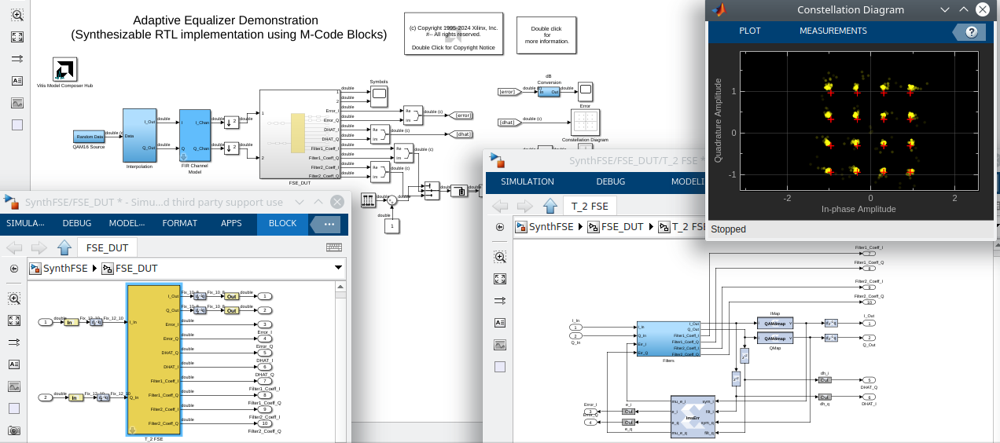

# LMS-based adaptive equalization (Synthesizable RTL)

This design shows how to use the MCode block to create fully synthesizable register transfer level (RTL) designs in Model Composer. The design was derived directly from the sysgenFSE.mdl demonstration design, replacing non-RTL blocks by MCode block equivalents. RTL targets are particularly useful when single source must target different FPGA families. This design shows a T/2 adaptive Fractionally Spaced Equalizer (FSE) operating on a 16-QAM data source with noise and filtering introduced in the channel model. Virtex-II dedicated multipliers are used in the complex multipliers blocks in order to provide high speed and resource utilization of the FPGA device.

The DHAT scope provides an X-Y plot of the I and Q filter outputs from within the FSE. As the simulation progresses, these symbols will converge as the error is reduced. The magnitude of the filter coefficients is shown in a vector scope as well. Increasing the simulation duration will allow better visualization of the adaptive FSE effects on the filter output.

For additional information on FSE:

J.R. Treichler, I. Fijalkow, and C.R. Johnson, Jr. "Fractionally Spaced Equalizers" IEEE Signal Processing Magazine, May 1996, pp. 65-81.

Chris H. Dick, "Design and implementation of high-performance FPGA signal processing datapaths for software-defined radios" VMEbus Systems, August 2001.

------------
Copyright 2020 Xilinx

Licensed under the Apache License, Version 2.0 (the "License");
you may not use this file except in compliance with the License.
You may obtain a copy of the License at

    http://www.apache.org/licenses/LICENSE-2.0

Unless required by applicable law or agreed to in writing, software
distributed under the License is distributed on an "AS IS" BASIS,
WITHOUT WARRANTIES OR CONDITIONS OF ANY KIND, either express or implied.
See the License for the specific language governing permissions and
limitations under the License.
