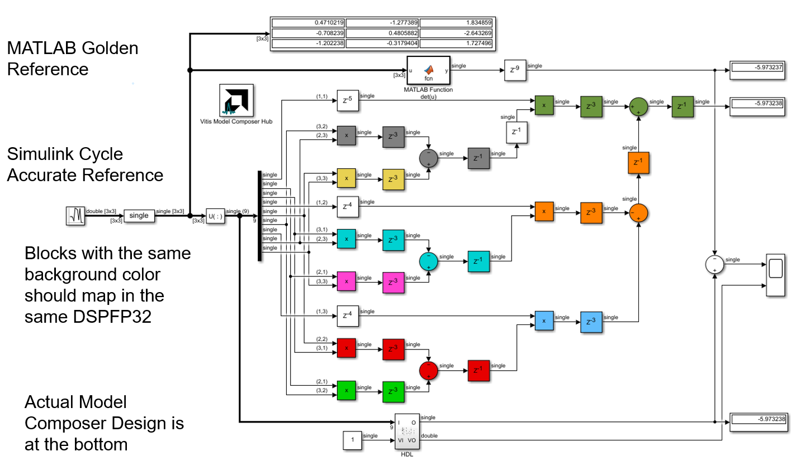
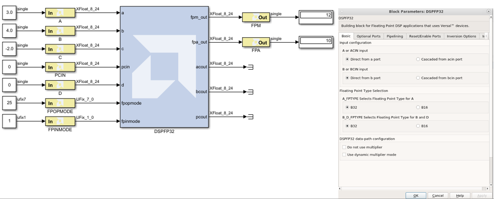
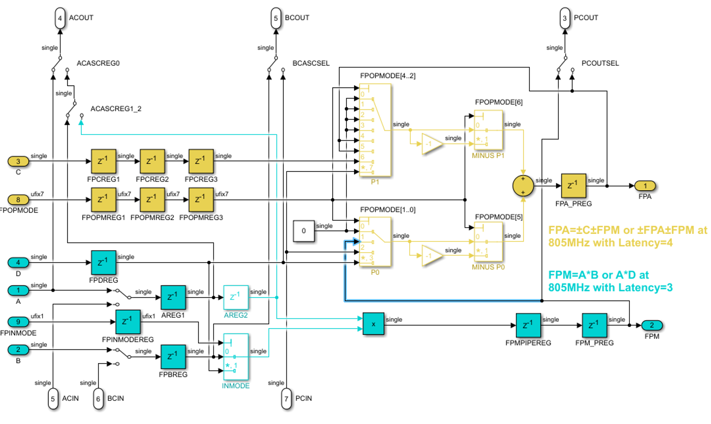

# 3x3 Matrix Determinant

This design demonstrates the calculation of the determinant of a 3x3 matrix with real, single precision floating point elements. It showcases the Black Box block for bringing hand-coded VHDL or Verilog code into Model Composer. It also shows the DSPFP32 for performing floating-point operations on Versal devices.

## Design

The Simulink model implements the 3x3 Matrix Determinant in 3 different ways, and compares them to each other:

1. The MATLAB function `det(u)`.
2. Basic Simulink blocks that decompose the determinant calculation into multiplication and addition operations.
3. Model Composer blocks (including DSPFP32) for which HDL code can be generated.

A second model is provided that replaces method 3 with a hand-coded VHDL implementation of the 3x3 matrix determinant. The VHDL is brought into Model Composer as a Black Box block.

## Mathematical Background

Matrix determinant formulas can be defined recursively for matrices of increasing sizes. A 3x3 matrix determinant can be calculated using the equations below. These calculations require 9 multiplications and 5 additions. These operations map directly into 9 DSPFP32 blocks on the hardware.

## DSPFP32 Floating-Point Block

Vitis Model Composer's HDL library has a block that maps to a DSPFP32 primitive. This primitive supports single-precision floating-point multiplication and addition operations. The DSPFP32 primitive maps to hardened DSP58s on Versal devices.

The images below show the flow diagram of the DSPFP32 and the supported latency and throughput (on Versal) for independent multiply and add mode, follow by multiply-accumulate (MAC) mode:

9 instances of the DSPFP32 block are connected to implement the 3x3 matrix determinant, as shown below:

------------
Copyright 2023 Advanced Micro Devices, Inc.

Licensed under the Apache License, Version 2.0 (the "License");
you may not use this file except in compliance with the License.
You may obtain a copy of the License at

    http://www.apache.org/licenses/LICENSE-2.0

Unless required by applicable law or agreed to in writing, software
distributed under the License is distributed on an "AS IS" BASIS,
WITHOUT WARRANTIES OR CONDITIONS OF ANY KIND, either express or implied.
See the License for the specific language governing permissions and
limitations under the License.
