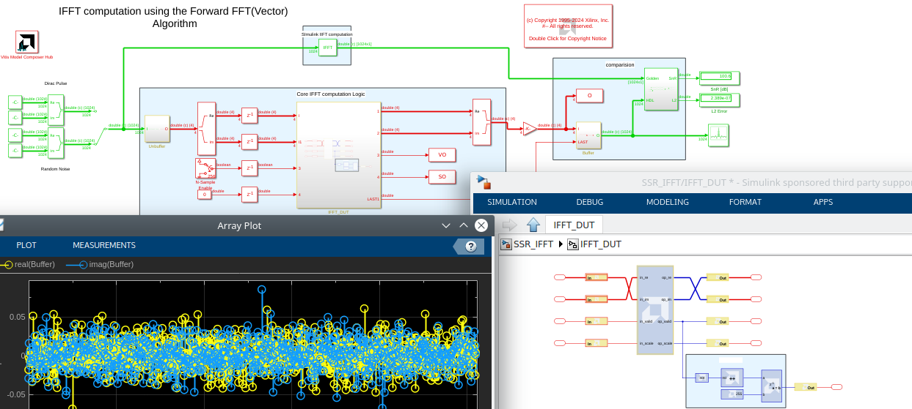

# IFFT computation using the Vector FFT block

This model computes the Inverse FFT using an FFT block. Here we swap the real and imaginary part of the input. 

By swapping the real and imaginary parts of the output of FFT and normalizing (divide by N), this system is equivalent to an inverse FFT. The Vector FFT block used in this design has one extra configuration parameter, 'SSR', to define the parallelism in computation. In this case, SSR=4 and N=1024. The Output of IFFT is computed 4 times faster.

Finally, the output from Vector FFT is compared with the Simulink IFFT block and plotted accordingly.

------------
Copyright 2020 Xilinx

Licensed under the Apache License, Version 2.0 (the "License");
you may not use this file except in compliance with the License.
You may obtain a copy of the License at

    http://www.apache.org/licenses/LICENSE-2.0

Unless required by applicable law or agreed to in writing, software
distributed under the License is distributed on an "AS IS" BASIS,
WITHOUT WARRANTIES OR CONDITIONS OF ANY KIND, either express or implied.
See the License for the specific language governing permissions and
limitations under the License.
