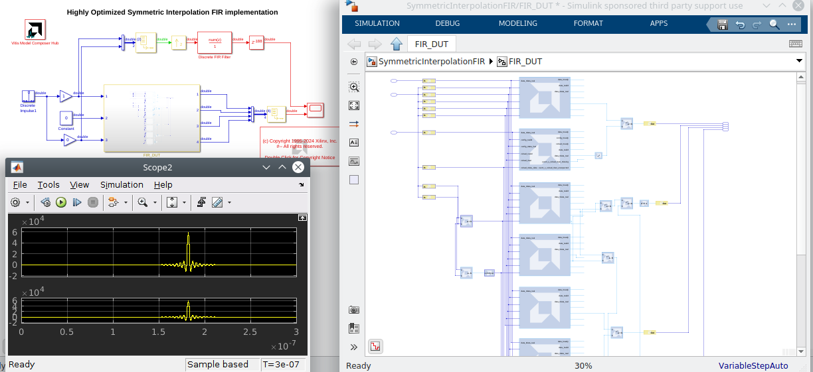

# Highly Optimized Symmetric Interpolation FIR implementation

This design fills the gap of configuring FIR compiler blocks for symmetric interpolation filter and implementing it with minimal resources. It shows a 273-tap polyphase FIR filter, which consumes 4 samples per clock cycle, interpolate by 2 (1 GSPS input rate to 2GSPS output rate), and Symmetric coefficients using FIR compiler blocks.

In this design, we try to decompose the interpolation symmetric FIR into eight single-rate sub-filters that normal FIR Compiler can handle. The symmetry (even, odd and even anti-symmetric) is achieved by re-arranging the coefficients as implemented in design.

------------
Copyright 2020 Xilinx

Licensed under the Apache License, Version 2.0 (the "License");
you may not use this file except in compliance with the License.
You may obtain a copy of the License at

    http://www.apache.org/licenses/LICENSE-2.0

Unless required by applicable law or agreed to in writing, software
distributed under the License is distributed on an "AS IS" BASIS,
WITHOUT WARRANTIES OR CONDITIONS OF ANY KIND, either express or implied.
See the License for the specific language governing permissions and
limitations under the License.
