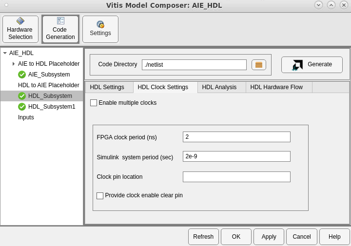
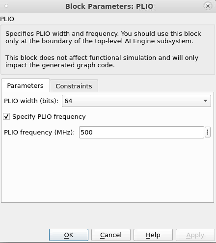
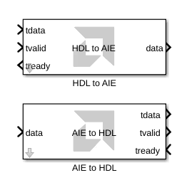
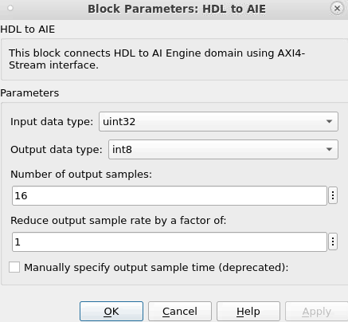
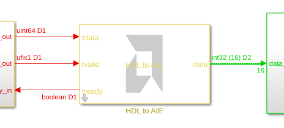
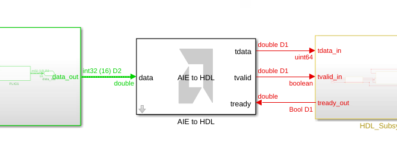
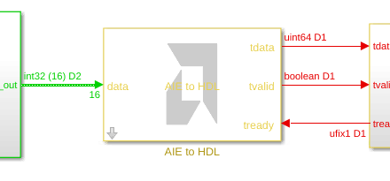

<table class="sphinxhide" width="100%">
 <tr width="100%">
    <td align="center"><h1>AI Engine Development</h1>
    <a href="https://www.xilinx.com/products/design-tools/vitis.html">See Vitis™ Development Environment on xilinx.com</br></a>
    <a href="https://www.xilinx.com/products/design-tools/vitis/vitis-ai.html">See Vitis™ AI Development Environment on xilinx.com</a>
    </td>
 </tr>
</table>

# Connecting AI Engine and HDL Subsystems

This tutorial will explore how to model heterogeneous systems (consisting of AI Engine and PL components) in Vitis Model Composer.

The Vitis Model Composer HDL block library performs cycle-accurate simulation, while the AI Engine library does functional simulation. This tutorial will show how to use the **AIE to HDL** and **HDL to AIE** blocks to connect the HDL and AIE simulation domains to accurately model how the AIE-PL interface will behave in hardware. 

## Review the Tutorial Model

1. Open the model `AIE_HDL.slx`. 

2. Right-click on an empty part of the canvas. In the context menu that displays, ensure that the following options are selected:
* **Sample Time Display -> All**
* **Other Displays -> Signals & Ports -> Signal Dimensions**
* **Other Displays -> Signals & Ports -> Port Data Types**.

3. On the **Modeling tab**, select **Update Model**.

4. Open the **Timing Legend** by pressing `Ctrl+J`.

This model implements a simple passthrough design that sends integer data from the PL to the AI Engine and back.


The interfaces between the AI Engine and HDL parts of the design are initially implemented with placeholder blocks. In this tutorial, we will see how to replace these placeholders with the **HDL to AIE** and **AIE to HDL** blocks.

## HDL Subsystem

The Vitis Model Composer HDL block library performs cycle-accurate simulation. The sample times in Simulink will correlate with the sample times of the design running on the hardware. How they correlate is specified in the **Vitis Model Composer Hub** block, under the **HDL Clock Settings** tab.

5. Double-click on the **Vitis Model Composer Hub** block.

6. Select the **HDL_Subsystem** and the **HDL Clock Settings** tab.



The **FPGA clock period** and **Simulink system period** settings control how the Simulink sample times are reflected in the generated HDL code. When the **FPGA clock period** corresponds to the desired hardware clock rate, and **Simulink system period** is equal to the same value, then the sample times observed in Simulink will match those of the design running in hardware. In this case, the settings correspond to a FPGA clock rate of 500 MHz.

For more information on these parameters, see the [Vitis Model Composer Hub documentation](https://docs.xilinx.com/r/en-US/ug1483-model-composer-sys-gen-user-guide/Vitis-Model-Composer-Hub). 

For more information on how timing and clocks are modeled in Vitis Model Composer, see [Bit-True and Cycle-True Modeling](https://docs.xilinx.com/r/en-US/ug1483-model-composer-sys-gen-user-guide/Bit-True-and-Cycle-True-Modeling) and [Timing and Clocking](https://docs.xilinx.com/r/en-US/ug1483-model-composer-sys-gen-user-guide/Timing-and-Clocking) in the Vitis Model Composer User Guide. 

With that in mind, lets refer to the sample times in the Simulink model.

7. From the top level of the model, double-click on the **HDL_Subsystem** to open it.


This HDL subsystem contains a simple FIFO block and AXI4-Stream input and output interfaces. The AXI4-Stream interface is required to interface an HDL subsystem with the AI Engine. AXI4-Stream interfaces have a minimum of 3 signals:

* `tdata`: The data signal.
* `tvalid`: Signal indicating the producer is producing valid data on the `tdata` signal.
* `tready`: Signal indicating the consumer is ready to receive data on the `tdata` signal.

For more information, see [How AXI4-Stream Works](https://docs.xilinx.com/r/en-US/ug1399-vitis-hls/How-AXI4-Stream-Works).

8. Open the **Gateway In AXIS** and **Gateway Out AXIS** blocks and refer to the Sample Period parameter.


Note the sample period of 2 ns in each block. 

Also note that the signal lines are all a single color, indicating a single sample rate for this subsystem. Referring to the timing legend, the sample period of this subsystem is 2 ns, corresponding to a sample rate of 500 MHz.


>**TIP:** You can click the button labeled `1/P` in the Timing Legend to view timing information in terms of rate instead of period.
>
>

## AIE Subsystem

Unlike the HDL block library, the Vitis Model Composer AI Engine blocks do not perform cycle-accurate simulation. In fact, the observed sample times in the Simulink model do not correspond to the AI Engine's hardware clock rate. Instead these blocks allow for functional or bit-accurate simulation. 

9. Return to the top-level `AIE_HDL` model and double-click the **AIE_Subsystem** to open it.

The AIE subsystem contains a single kernel that performs a simple passthrough. You can view the AIE kernel code in the `passthrough.cpp` file.

10. Double-click on the **passthrough** block.


In the function declaration, note that this kernel's input and output are `int32` values. Also note the `FRAME_LENGTH` parameter, set to 16, which also corresponds to the size of the input and output buffers.

11. Close the **passthrough** block parameters and open the first **PLIO** block.



The PLIO block defines the hardware interface between the AI Engine and the PL. 

The **PLIO width** should match the bit width of the HDL subsystem's output. Here, **PLIO width** is `64`, which means that 2 `int32` values will be transferred from the PL to the AIE on each PL clock cycle. 

The **PLIO frequency** is 500 MHz, which matches the expected rate of our HDL subsystem (see above). 

The combination of the PLIO width and frequency mean that the AI Engine effectively consumes `int32` values at a rate of 1 GHz.

>**IMPORTANT:** The parameters specified in the PLIO block do not affect the functional simulation or observed sample times in Simulink. These parameters only affect the generated AI Engine graph code and how the design is simulated in the cycle-approximate `aiesimulator`.

The second PLIO block is configured identically to transfer `int32` values from AIE to PL at a rate of 1 GHz.

## Interface From HDL to AIE

As mentioned above, the HDL blocks perform cycle-accurate simulation while AI Engine blocks do not. It is necessary to provide a "bridge" between the two simulation domains in Simulink. The **HDL to AIE** and **AIE to HDL** blocks accomplish this.



These blocks translate between HDL and AI Engine data types. They also determine the Simulink sample rate of the AI Engine design, based on the HDL sample rate and the relationship between the HDL/AIE data types.

12. Remove the **HDL to AIE Placeholder** subsystem.

13. Click an open area of the canvas, type `HDL to AIE`, and select the **HDL to AIE** block (or select the block from the Simulink Library Browser).

14. Connect the **HDL to AIE** block where the placeholder block used to be.


15. Double-click the **HDL to AIE** block to open its parameters.



16. Configure the block as follows:

* **Input data type:** `uint64` The HDL output signal is 64 bits wide. In Simulink, this is modeled as a `uint64`.
* **Output data type:** `int32` The AI Engine kernel expects an `int32` input. On each HDL clock cycle, the HDL to AIE block will split the 64-bit input into 2 32-bit outputs at twice the rate.
>**NOTE:** When converting input to output data types, the HDL to AIE block only splits the underlying bits of the data; it does not change their numerical values.
* **Number of output samples:** `16` The AI Engine kernel's input buffer is 16 samples.
* **Reduce output sample rate by a factor of:** `1` The HDL subsystem produces valid data on every clock cycle.

>**When would you reduce the output sample rate?**
>
>If the HDL subsystem does not produce valid data on every clock cycle, the AI Engine subsystem will operate at a reduced rate. The **Reduce output sample rate** parameter allows the **HDL to AIE** block to model this behavior.
>
>For example, if the HDL subsystem asserts `tvalid` every 4 HDL clock cycles, set the **Reduce output sample rate by a factor of** parameter to 4. 
>
>If you do not do this, the **HDL to AIE** block will output a variable-size signal that is empty when there is no valid data. For more information, see the [Variable-Size Signals](https://github.com/Xilinx/Vitis_Model_Composer/tree/2023.2/QuickGuides/Variable_Size_Signals) Quick Guide.


17. Press **Apply** and **OK**.

18. Press `Ctrl+D` to update the model.

The **HDL to AIE** block's sample times and output data types and dimensions are updated:



* The output sample rate (green color) is 62.5 MHz. This is calculated by `(HDL sample rate) * (Samples per HDL clock cycle) / (Number of output samples)`: `500 MHz * 2 / 16 = 62.5 MHz` 
* The output data type is `int32`.
* The output signal is a variable-sized signal with a maximum size of `16`.

## Interface From AIE to HDL

The bridge from AIE to HDL is more straightforward. We only need to know the HDL subsystem's input data type and sample rate.

19. Remove the **AIE to HDL Placeholder** subsystem.

20. Click an open area of the canvas, type `AIE to HDL`, and select the **AIE to HDL** block (or select the block from the Simulink Library Browser).

21. Connect the **AIE to HDL** block where the placeholder block used to be.



22. Double-click the **AIE to HDL** block to open its parameters.


23. Configure the block as follows:

* **Output Data Type:** `uint64` The HDL subsystem expects a 64-bit wide input, modeled in Simulink as a `uint64`. The AIE to HDL block will combine 2 subsequent `int32` inputs into a single `uint64` output.
* **Output Sample Time:** `Inherit: Same as tready` The HDL subsystem will determine its own sample rate.


24. Press **Apply** and **OK**.

25. Press `Ctrl+D` to update the model.

The **AIE to HDL** block's sample times and output data types and dimensions are updated:



* The output sample rate is 500 MHz. This is determined by the Sample Period parameter of the Gateway blocks inside of the HDL subsystem (`HDL_Subsystem1`).
* The output data type is `uint64`.
* The output signal is a scalar value. The **AIE to HDL** block always outputs a scalar value for input to the HDL subsystem.

## Key Takeaways

* HDL designs in Vitis Model Composer are cycle-accurate.
* The **Sample Period**, **Simulink system seriod**, and **FPGA clock period** parameters are used to set the HDL sample rate.
* AI Engine designs in Vitis Model Composer are not cycle-accurate.
* The **PLIO** block defines the bit width and clock rate of the AIE-PL interface. This information is only used in the generated code and cycle-approximate SystemC simulation; it has no bearing on the Simulink simulation.
* The **AIE to HDL** to **HDL to AIE** blocks translate between HDL and AI Engine data types. 
* They also determine the Simulink sample rate of the AI Engine design, based on the HDL sample rate and the relationship between the HDL/AIE data types. 

---

&copy; Copyright 2023 Advanced Micro Devices, Inc.

Licensed under the Apache License, Version 2.0 (the "License");
you may not use this file except in compliance with the License.
You may obtain a copy of the License at

```
    http://www.apache.org/licenses/LICENSE-2.0
```

Unless required by applicable law or agreed to in writing, software
distributed under the License is distributed on an "AS IS" BASIS,
WITHOUT WARRANTIES OR CONDITIONS OF ANY KIND, either express or implied.
See the License for the specific language governing permissions and
limitations under the License.
