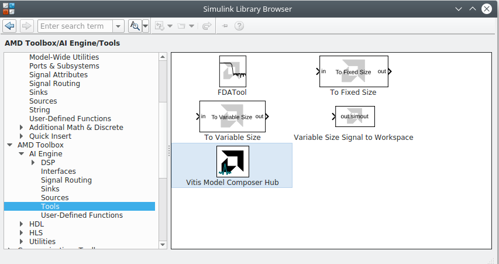
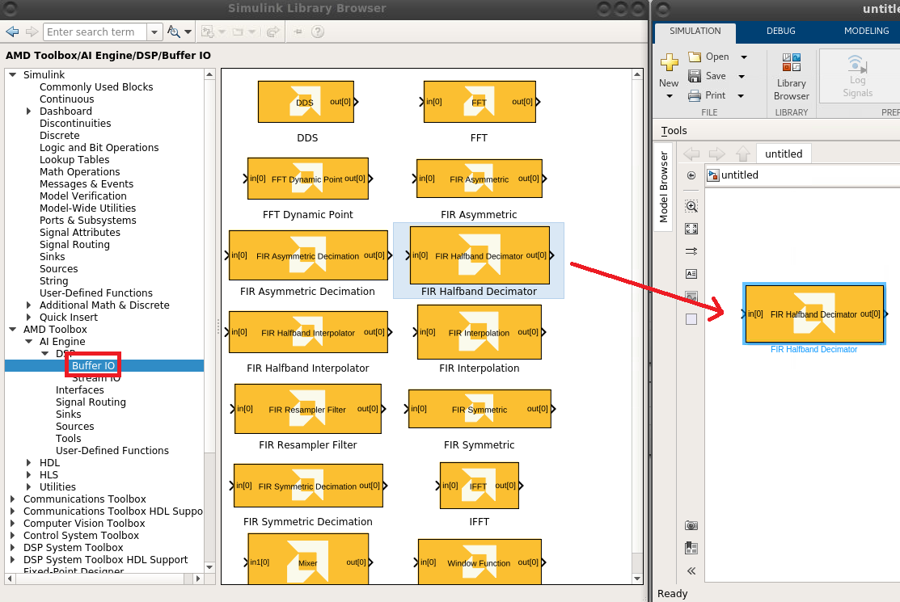
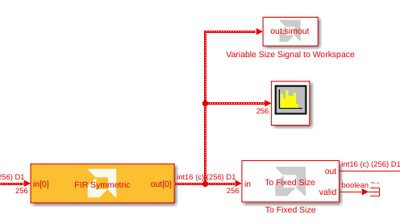

<table class="sphinxhide" width="100%">
 <tr width="100%">
    <td align="center"><h1>AI Engine Development</h1>
    <a href="https://www.xilinx.com/products/design-tools/vitis.html">See Vitis™ Development Environment on xilinx.com</br></a>
    <a href="https://www.xilinx.com/products/design-tools/vitis/vitis-ai.html">See Vitis™ AI Development Environment on xilinx.com</a>
    </td>
 </tr>
</table>

# Lab 2: Build and Simulate an AI Engine Design

In this lab, you will begin building the decimation chain design using AI Engine DSP library functions. You will also see how to use Vitis Model Composer to inspect the functional performance of the design.

:warning: This AI Engine Lab can be done only in a Linux environment.

### Procedure
This lab has the following steps:
 * In Step 1, you will construct a simple model that compares the output of a single AI Engine filter to a golden reference.
 * In Step 2, you will add the remaining filters to the model to continue building up the decimation chain.
 * In Step 3, you will see how to attach additional scopes and log signals to the MATLAB workspace for further analysis.
  
## Step 1: Model a Single AI Engine Filter

In this step, you will create a simple testbench for a block from the [AI Engine DSP Library](https://github.com/Xilinx/Vitis_Libraries/tree/main/dsp).

1. Run the ***setupLab2*** script to initialize a working directory and preload the DSP filter configurations.

2. On the MATLAB GUI, select the **Home Tab** and click **Simulink**.


3. Select **Blank Model** to create a new canvas on which to design the Decimation Chain.


4. Click on **Library Browser**.

5. Find the **Vitis Model Composer Hub** block in the **AMD Toolbox -> AI Engine -> Tools** library.



6. Drag and drop the **Vitis Model Composer Hub** block into the empty model.

Perform the next step to automatically call the filter configuration script when opening the design or when you update it.

7. Right-click in the canvas and select **Model Properties**:
    * Click the **Callbacks** tab.
    * Click **PreLoadFcn** and type `CreateFilter;` in the edit window on the right.
    * Click **InitFcn** and type `CreateFilter;` in the edit window on the right.
    * Click **Apply**.


Save the model **CTRL+S** and assign the name **VMC_DecimationChain**.

8. Click the **Library Browser** icon.


Find the **AMD Toolbox**, which contains three sub-libraries:
* AI Engine
* HDL
* HLS

Click the **AI Engine** section. This reveals the following sub-sections:

* DSP
* Interfaces
* Signal Routing
* Sinks
* Sources
* Tools
* User-Defined functions

9. Click the **DSP** sub-section. There are 2 sub-menu entries:
- Buffer IO: which contains filter implementations using frame-based input and output.
- Stream IO : which contains filter implementations using streaming input and output:


10. Click the **Buffer IO** sub-section and place the **FIR Halfband Decimator** block in the canvas as shown in the following figure.




11. Double-click the **AIE FIR Halfband Decimator** block to open the GUI. Populate the GUI with the following parameters :
    * **Input/output data type**: cint16
    * **Filter coefficients data type**: int16
    * **Filter coefficients**: hb1_aie
    * **Input Window size (Number of samples)**: 2048
    * **Scale output down by 2**: Shift1
    * **Rounding mode**: Floor

    Click **Apply** and **OK**.


Now create a data source to feed this filter.

12. Create the following two blocks by clicking the canvas and typing the beginning of the name of the block. Then enter the given parameters:

| Name to Type | Block Name to Select | Parameters |
| :--- | :--- | :--- |
| random   | Random Source  |  Source Type: Uniform <br> Minimum: -30000  <br> Maximum: 30000  <br>  Sample time: 1   <br> Samples per frame: 2048   <br> Complexity: complex|
| cast  | Cast  | Output data type: int16  |

13. Cascade the three blocks: **Random Source**, **Cast**, **AIE FIR Filter**.

14. The file ``ReferenceChain.slx`` contains the decimation chain using Simulink blocks. **Open** the file **ReferenceChain.slx**. Copy the block **HB1** over to your design.

15. Copy the small set of blocks (**To Fixed Size**, **Subtract**, **Scope**) to create the following design:


16. In the Simulink toolstrip, set the **Stop Time** to ``5000`` and click **Run** to simulate the design. The FIR filter is compiled and the design is run. 

17. Double-click the **Scope** block to view the simulation results. The Error scope should show a completely null difference.


18. To gain more information about the signals traveling through the wires, update the following display parameters:
    * Right-click the canvas and select **Other Displays --> Signals and Ports --> Signal Dimensions**.
    * Right-click the canvas and select **Other Displays --> Signals and Ports --> Port Data Types**.
    * Right-click the canvas and select **Sample Time Display --> all**.

After updating the design with **CTRL-D**, the display should look as follows:


Notice that before implementing the Decimation Filter the vector length was ``2048``, but after implementation this was reduced to ``1024``. This corresponds to decimation by a factor of 2.

## Step 2: Add Additional Filters to the Model

1. Update the design with the other three filters using the following parameters:


| Parameter |HB1 |	HB2	| HB3	| Channel Filter |
| :--- | :--- |  :--- | :--- | :--- |
| Filter Block	| FIR Halfband Decimator | FIR Halfband Decimator	| FIR Halfband Decimator	| FIR Symmetric Filter |
| Input Output data type	| cint16	| cint16	| cint16	| cint16 |
| Filter Coefficients Data Type	| int16	| int16	| int16	| int16 |
| Filter Coefficients	| hb1_aie	| hb2_aie	| hb3_aie	| cfi_aie |
| Filter Length	| N/A | N/A	| N/A | length(cfi) |
| Input window size (Number of samples)	| 2048	| 1024	| 512	| 256 |
| Scale output down by 2^	| Shift1	| Shift2	| Shift3	| ShiftCF |
| Rounding mode	floor	| floor	| floor	| floor | floor |

3. Update the **Output Size** parameter of the **To Fixed Size** block to ``256``. The design should look like as follows:


4. Run the design. The added filters are compiled and the design is run through the 5000 samples. The difference between the outputs should still be 0.

## Step 3: Further Analysis of the Design

When creating a DSP design, one of the most important parameters to consider is the spectrum. In Simulink, the spectrum can be displayed using a spectrum scope.

1. Click on the canvas and type ``spectrum``.
2. Select **Spectrum Analyzer** from the DSP System Toolbox.
3. Connect the spectrum scope at the output of the last filter (the Channel Filter).
4. Set the Stop Time of the simulation to **inf**.


Run the simulation. The spectrum scope should display similar to the following:


You can easily place a spectrum scope anywhere within the model to study the signal at different stages of the design. Furthermore, Simulink has a lot of specific blocksets that can be used to generate test vectors, create a reference model, and compare the signals at any point in the design.

You can also export any signal to the MATLAB workspace for more complex analysis: 

5. Stop the simulation if it is still running.
6. Click on the canvas and type ``variable size``.
7. Select **Variable Size Signal to Workspace** from the **Xilinx Toolbox --> AI Engine --> Tools** library.
8. Connect the block to the output of the FIR Symmetric filter.



9. Set the Stop Time of the simulation to **5000** and run the simulation.
10. Type the following in the MATLAB Command Window: ``plot(abs(out.simout))`` This plots the magnitude of the complex-valued AI Engine output.

The signal should display similar to the following. You can now work with the simulation output just like any other variable in the MATLAB workspace.


> **Why use *__Variable Size Signal to Workspace__* instead of *__To Workspace__*?**
>
> AI Engine kernels can consume or produce different numbers of data samples (or no data samples at all) each time they are invoked. To model this behavior in Simulink, Vitis Model Composer uses [variable-sized signals](https://www.mathworks.com/help/simulink/ug/variable-size-signal-basics.html), which are denoted by the thick dashed line between the AI Engine blocks. In this model, there is a **To Fixed Size** block that converts the variable-sized signal to a fixed-size signal with a valid signal that indicates when data is actually present. **Variable Size Signal to Workspace** is a convenience block that behaves similarly to **To Workspace**, but it automatically discards empty samples in the variable-sized signal and concatenates the valid samples into a single MATLAB vector. 
>
> For more details, refer to [Variable-Sized Signals](https://docs.xilinx.com/r/en-US/ug1483-model-composer-sys-gen-user-guide/Variable-Size-Signals) in the Vitis Model Composer documentation.

AI Engine simulations within Simulink are bit-exact but do not provide timing information for the design as it will run on the hardware. In later labs, we will see how to invoke the cycle-approximate AIE Simulator and view timing analysis results from within Vitis Model Composer.

## Conclusion

**Congratulations!** This concludes Lab 2. In this lab, you built a model of the decimation chain using blocks from the AI Engine DSP Library. You also used Simulink scopes to compare the AI Engine implementation of the design against a golden reference.

In the next lab, you will see how to bring in custom AI Engine kernel or graph code and simulate it with Vitis Model Composer.

---
&copy; Copyright 2023-2024 Advanced Micro Devices, Inc.

Licensed under the Apache License, Version 2.0 (the "License");
you may not use this file except in compliance with the License.
You may obtain a copy of the License at

```
    http://www.apache.org/licenses/LICENSE-2.0
```

Unless required by applicable law or agreed to in writing, software
distributed under the License is distributed on an "AS IS" BASIS,
WITHOUT WARRANTIES OR CONDITIONS OF ANY KIND, either express or implied.
See the License for the specific language governing permissions and
limitations under the License.

<p align="center"><sup>XD058 | &copy; Copyright 2023 Advanced Micro Devices, Inc.</sup></p>
