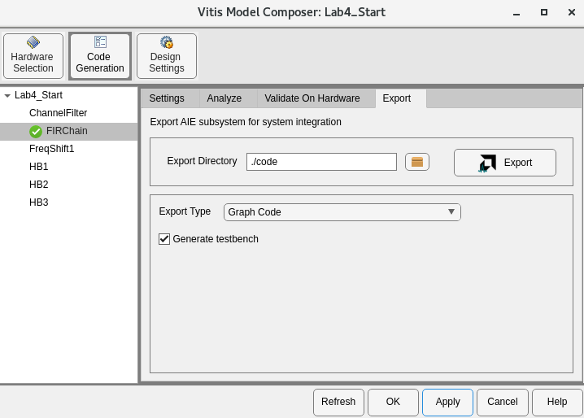
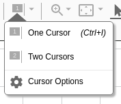
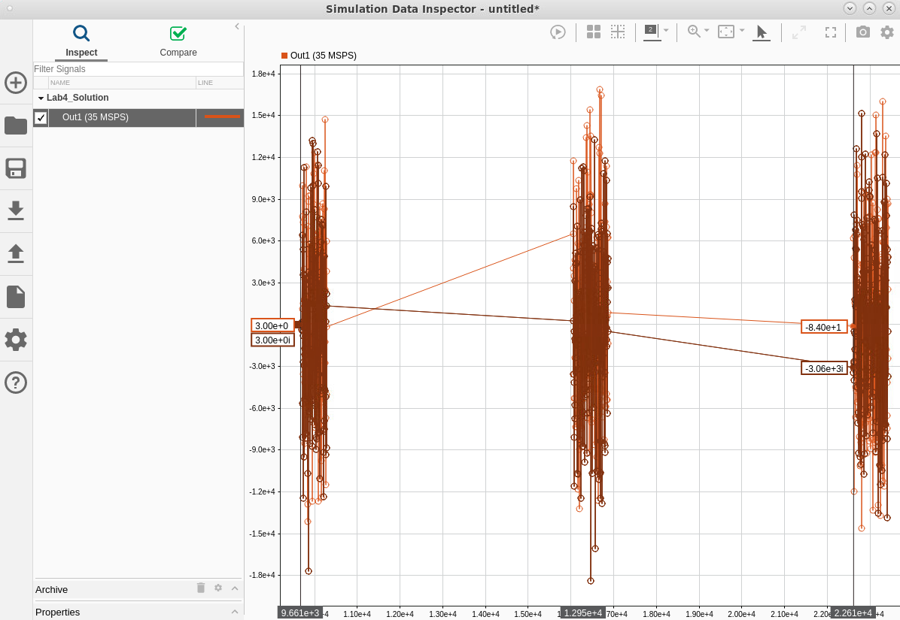

<table class="sphinxhide" width="100%">
 <tr width="100%">
    <td align="center"><h1>AI Engine Development</h1>
    <a href="https://www.xilinx.com/products/design-tools/vitis.html">See Vitis™ Development Environment on xilinx.com</br></a>
    <a href="https://www.xilinx.com/products/design-tools/vitis/vitis-ai.html">See Vitis™ AI Development Environment on xilinx.com</a>
    </td>
 </tr>
</table>

# Lab 4: AI Engine Code Generation and Cycle-Approximate Simulation

This lab shows how to use Vitis Model Composer to generate AI Engine graph code and simulate an AI Engine design.

:warning: This AI Engine Lab can be done only in a Linux environment.

### Procedure
This lab has the following steps:
 * In Step 1, you will use Vitis Model Composer to generate AI Engine graph code for the decimation filter chain design.
 * In Step 2, you will simulate the design using the AI Engine Simulator and review the design's estimated throughput.
 * In Step 3, you will review design artifacts generated by Vitis Model Composer and see how they can help integrate the AI Engine kernel with a larger design.

## Step 1: Generate AI Engine Graph Code

In this step, you will generate and review graph code for the decimation filter chain.

1. Run the ***setupLab4*** script to initialize a working directory.

2. Open the model ``Lab4_Start.slx``.

3. Select the four AIE FIR Filters and the FreqShift block and type ***Ctrl+G*** to group them in a subsystem. Assign a new name: **FIRchain**.

4. Double-click the Model Composer Hub block. 

5. On the **Hardware Selection** tab, click the **...** button next to Select Hardware to open the Device Chooser.

6. Type ***xcvc1902*** into the Search box.

7. Select the first device on the list (beginning with ***xcvc1902***) and click **OK**.

8. Back in the Vitis Model Composer Hub block, on the Code Generation tab, select the FIRchain subsystem. 
    
9. And then select Export tab, select **Generate testbench**.

10. Click **Apply**.

11. Click **Export**.



The Simulink model is run to generate the testbench, then the AI Engine graph code is generated and compiled. 

The source code can be viewed in ``./code/ip/FIRchain/src/FIRchain.h``.

Let's review this code:

```C++
#ifndef __XMC_FIRCHAIN_H__
#define __XMC_FIRCHAIN_H__

#include <adf.h>
#include "./FIR_Halfband_Decimator_f290cd69/FIR_Halfband_Decimator_f290cd69.h"
#include "./FIR_Halfband_Decimator_9d303e82/FIR_Halfband_Decimator_9d303e82.h"
#include "./FIR_Halfband_Decimator_e4b5f201/FIR_Halfband_Decimator_e4b5f201.h"
#include "./FIR_Symmetric_5c1535c2/FIR_Symmetric_5c1535c2.h"
#include "FreqShift.h"
```

The graph is defined as a class derived from the class ``adf::graph``. The class definition declares the four FIR filters and our custom FreqShift kernel:

```C++
class FIRchain_base : public adf::graph {
public:
   FIR_Halfband_Decimator_f290cd69 FIR_Halfband_Decimator;
   FIR_Halfband_Decimator_9d303e82 FIR_Halfband_Decimator1;
   FIR_Halfband_Decimator_e4b5f201 FIR_Halfband_Decimator2;
   FIR_Symmetric_5c1535c2 FIR_Symmetric;
   adf::kernel FreqShift_0;
```

The graph class constructor instantiates an input port, an output port, and the FreqShift kernel (with a ``FRAME_LENGTH`` of 256). Because the FIR filters come from the DSP Library, they are instantiated in their own source files.

```C++
public:
   adf::input_port In1;
   adf::output_port Out1;

   FIRchain_base() {
      // create kernel FreqShift_0
      FreqShift_0 = adf::kernel::create(FreqShift<256>);
      adf::source(FreqShift_0) = "FreqShift.cpp";
```

The graph class constructor also specifies a runtime *constraint* on the FreqShift kernel. We will talk more about constraints in Lab 5. This constraint states that the kernel can be expected to use 90% of an AI Engine tile's compute resources, so the ``aiecompiler`` should assign this kernel to its own tile.

```C++
      // create kernel constraints FreqShift_0
      adf::runtime<ratio>(FreqShift_0) = 0.9;
```

The ``adf::connect`` function describe how components of the graph connect together. These lines of code reproduce the layout of the decimation filter chain from the Simulink model, connecting the output of one block to the input of the next block.

```C++
      // create nets to specify connections
      adf::connect net0 (In1, FIR_Halfband_Decimator.in[0]);
      adf::connect net1 (FIR_Halfband_Decimator.out[0], FIR_Halfband_Decimator1.in[0]);
      adf::connect net2 (FIR_Halfband_Decimator1.out[0], FIR_Halfband_Decimator2.in[0]);
      adf::connect net3 (FIR_Halfband_Decimator2.out[0], FIR_Symmetric.in[0]);
      adf::connect net4 (FIR_Symmetric.out[0], FreqShift_0.in[0]);
      adf::dimensions(FreqShift_0.in[0]) = {256};
      adf::connect net5 (FreqShift_0.out[0], Out1);
      adf::dimensions(FreqShift_0.out[0]) = {256};
   }
};
```

The graph constructor is wrapped by another graph class that places PLIOs (Programmable Logic Input/Output) on each input and output. PLIOs establish stream connections between the AI Engine and Programmable Logic. PLIOs can be 32, 64, or 128 bits wide; the PLIO width determines how much data is transferred on each clock cycle. The default PLIO width generated by Vitis Model Composer is 32 bits. Later, we will see how to use Vitis Model Composer to change the PLIO width as a way to increase design throughput.

The ``input_plio`` and ``output_plio`` objects allow you to specify text files to use for input and output to the ``aiesimulator``. Vitis Model Composer has automatically generated an input text file and will parse the output when the simulation completes.

```C++
class FIRchain : public adf::graph {
public:
   FIRchain_base mygraph;

public:
   adf::input_plio In1;
   adf::output_plio Out1;

   FIRchain() {
      In1 = adf::input_plio::create("In1",
            adf::plio_32_bits,
            "./data/input/In1.txt");

      Out1 = adf::output_plio::create("Out1",
            adf::plio_32_bits,
            "Out1.txt");

      adf::connect< > (In1.out[0], mygraph.In1);
      adf::connect< > (mygraph.Out1, Out1.in[0]);
   }
};

#endif // __XMC_FIRCHAIN_H__
```

## Step 2: Review AI Engine Simulation Results

### Functional Verification

Because we selected **Create Testbench** in the Model Composer Hub block, Vitis Model Composer generates a testbench that compares the output of the AI Engine simulation to the Simulink simulation for the same input. The AI Engine simulation runs immediately after testbench generation because we selected the option in the Model Composer Hub block. In this case, the simulation results **MATCH** and the testbench **PASSED**. 

The Progress window displays the progress generating and compiling the AI Engine code. It also displays the final result of running the AI Engine simulation:


Regarding the simulation results, there are 3 possible outcomes:

* **Match:** All of the outputs of the Simulink simulation and AI Engine simulation exactly match. In this case, the testbench will **PASS**.
* **Partial Match:** The outputs of the Simulink simulation and AI Engine simulation match, but either the Simulink output or the AI Engine simulator output produced extra samples that are not accounted for in the other output. This can occur because there is not a direct link between the stop time in Simulink and the ``aiesimulator``'s timeout in cycles. In this case, the testbench will **PASS**.
* **Do Not Match:** There is a difference between the output of the Simulink simulation and the AI Engine simulation. In this case, the testbench will **FAIL**.

### Estimating Throughput

The ``aiesimulator`` is cycle-approximate, which means it can be used to estimate throughput of the AI Engine design. Because we selected **Plot AIE Simulation Output and Estimate Throughput** in the Model Composer Hub block, after simulation the Simulation Data Inspector opens and is populated with the results of the ``aiesimulator``. 

1. In the Simulation Data Inspector window, select the **Out1** signal from the Inspect menu.


The output of the AI Engine is plotted in the Simulation Data Inspector. The Simulation Data Inspector also contains a estimate of the AI Engine's throughput. The throughput is calculated by counting the number of output data points and dividing by the total time displayed on the X-axis. 

In this case, three frames are received but only two interframe idle time are taken into account. To obtain a more accurate throughput estimate, we can use data cursors to select a specific time region over which to calculate throughput.

2. Select the Cursor icon from the toolbar, then select **Two Cursors**. 

3. Position the cursors at the beginning of the first and third signal frames, as shown below.



This limits the throughput calculation to the area between the two cursors. In the figures above, the calculated throughput changes from 55 MSPS to 35 MSPS (your displayed value may vary slightly). This throughput is below our expected throughput for the decimation chain, which we expect to output samples at a rate of 125 MSPS. We will see how to improve the throughput in Lab 5.

## Step 3: Review Code Generation Artifacts

When you generate AI Engine code with Vitis Model Composer, a number of artifacts are also generated. These artifacts can be used to run the AI Engine simulation outside of Vitis Model Composer or to integrate the generated code within a larger project.

The artifacts include shell scripts and Makefiles for compiling, simulating, and building the AI Engine application. Makefiles are commonly used to build applications targeting Versal Adaptive SoC devices. For an example build flow that uses Makefiles, see the [Versal Custom Thin Platform](https://github.com/Xilinx/Vitis-Tutorials/tree/2023.1/Developer_Contributed/01-Versal_Custom_Thin_Platform_Extensible_System). 


* ``data/input/In1.txt``, ``data/reference_output/Out1.txt``: These are the input data and reference output data files, respectively, to be used with the ``aiesimulator``. These are simple text files where each row represents inputs/outputs for a simulation time stamp, and each column represents a different channel of data (or for complex data, the real and imaginary components of the data). These files are generated based on the inputs and outputs from the Simulink model.
* ``run_hw``: This folder contains scripts and Makefiles to run the design on hardware (Hardware Validation flow).
    * ``run_hw/run_hw.sh``: This script configures the shell environment before launching the Hardware Validation Makefile described below.
    * ``run_hw/Makefile``: The Hardware Validation Makefile executes a full compilation, linking, and packaging process to run a validation testbench of the design using either hardware emulation or real hardware. The Hardware Validation flow will be covered in more detail in Lab 6.
* ``src_aie``: This folder contains the generated source code for the AI Engine graph.
* ``src_pl_datamover``: This folder contains HLS kernels to move data between the AI Engine and the PL. Used as part of the Hardware Validation flow.
* ``src_ps``: This folder contains source code for a PS application to run the validation testbench (data movers and AI Engine design) on Versal hardware. Used as part of the Hardware Validation flow.
* ``FIRchain.cfg``: Vitis compiler link configuration file. This describes how the data movers and AI Engine are to be connected in the design running on hardware. For more information on this file, refer to [Linking the System](https://docs.xilinx.com/r/en-US/ug1076-ai-engine-environment/Linking-the-System) in AI Engine Tools and Flows User Guide (UG1076). 
* ``make.sh``: This script configures the shell environment before launching the Makefile described below.
* ``Makefile``: This Makefile compiles and simulates the AI Engine kernel portion of the design.

To reproduce Steps 1 & 2 of this lab outside of Vitis Model Composer, you can ``cd`` to the ``code`` folder and execute ``./make.sh`` from a bash shell. This script requires an environment variable named ``XILINX_VITIS`` to point to the Vitis installation location, such as ``/opt/Xilinx/Vitis/2022.2``.

You can also study and modify the generated Makefiles to incorporate the generated AI Engine code as part of a larger Versal Adaptive SoC design.

## Conclusion

**Congratulations!** This concludes Lab 4. In this lab, you generated AI Engine graph code from Vitis Model Composer, reviewed AI Engine simulation results, and learned about the code generation artifacts produced by Vitis Model Composer. The AI Engine simulation results showed that the design currently does not produce the desired throughput. 

In the next lab, you will see how to increase the design's throughput with PLIOs and AI Engine design constraints.

---

&copy; Copyright 2023 Advanced Micro Devices, Inc.

Licensed under the Apache License, Version 2.0 (the "License");
you may not use this file except in compliance with the License.
You may obtain a copy of the License at

```
    http://www.apache.org/licenses/LICENSE-2.0
```

Unless required by applicable law or agreed to in writing, software
distributed under the License is distributed on an "AS IS" BASIS,
WITHOUT WARRANTIES OR CONDITIONS OF ANY KIND, either express or implied.
See the License for the specific language governing permissions and
limitations under the License.

<p align="center"><sup>XD058 | &copy; Copyright 2023 Advanced Micro Devices, Inc.</sup></p>
