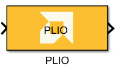
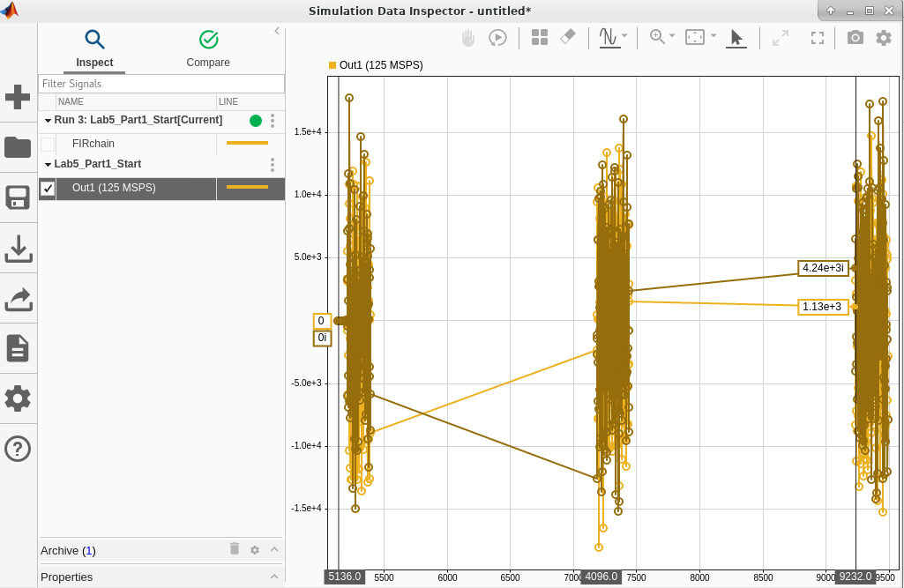
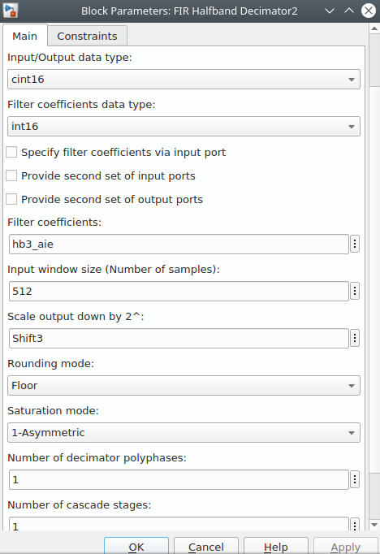
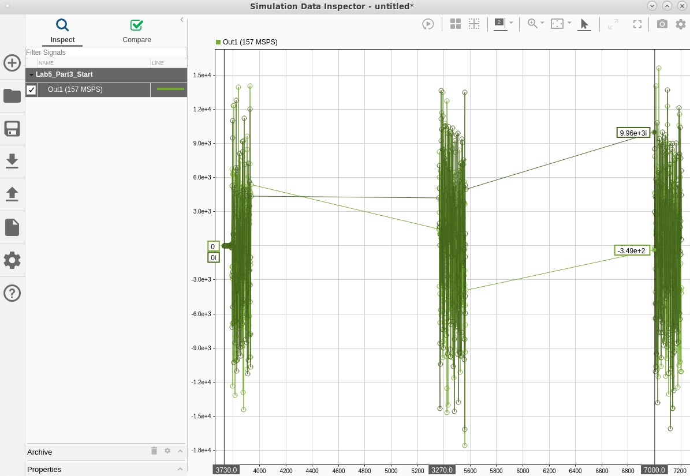
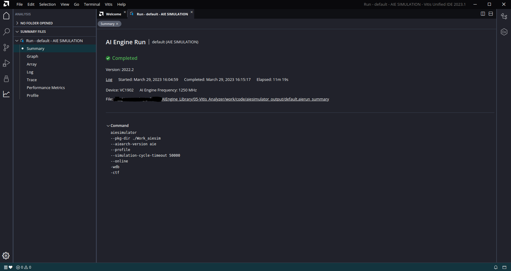
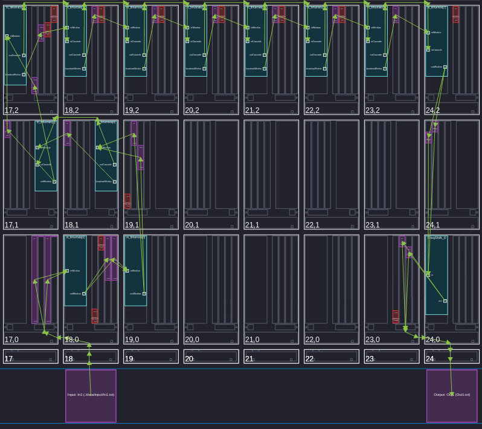
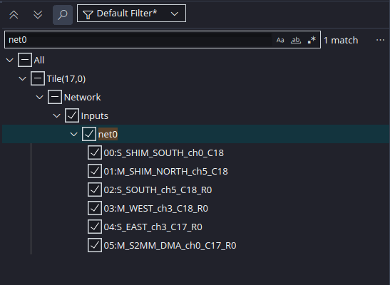

<table class="sphinxhide" width="100%">
 <tr width="100%">
    <td align="center"><h1>AI Engine Development</h1>
    <a href="https://www.xilinx.com/products/design-tools/vitis.html">See Vitis™ Development Environment on xilinx.com</br></a>
    <a href="https://www.xilinx.com/products/design-tools/vitis/vitis-ai.html">See Vitis™ AI Development Environment on xilinx.com</a>
    </td>
 </tr>
</table>

# Lab 5: AI Engine Throughput and Latency with Vitis Analyzer

This lab will take our existing decimation filter chain design and explore different techniques to increase algorithm throughput. We will also view detailed timing and resource information in the Vitis Analyzer.

:warning: This AI Engine Lab can be done only in a Linux environment.

### Procedure
This lab has the following steps:
 * In Step 1, you will add PLIO blocks to the boundary of the AI Engine subsystem and run cycle-approximate simulation to observe increased throughput.
 * In Step 2, you will use cascaded implementation of the FIR filter algorithm to further increase throughput.
 * In Step 3, you will view detailed timing information in the Vitis Analyzer and calculate latency.

## Step 1: Use PLIO Blocks to Increase Throughput

In Lab 4, we ran cycle-approximate AI Engine simulation to estimate the throughput of our decimation filter chain. We would expect a filter chain that decimates a 1 GSPS input by a factor of 8 to output samples at a rate of 125 MSPS. However, the estimated throughput we obtained in AI Engine simulation was much less than that, approximately 35 MSPS.

There are several ways to improve the throughput of AI Engine designs. In this lab, we will discuss two of them: ***increasing bandwidth between the PL and AIE*** and ***cascading algorithms across multiple AIE tiles***.

PLIO refers to a port attribute in the graph code that establish a stream connection to or from the programmable logic. Vitis Model Composer automatically generates a PLIO interface for each port at the boundary of the AIE design. PLIOs can be 32, 64, or 128 bits wide; the PLIO width determines how much data is transferred on each clock cycle.

You can use the ***PLIO*** block to change the PLIO width as well as the PL clock frequency. These values have no effect on the Simulink simulation, but they do affect the generated AI Engine graph code. The values are used by the cycle-approximate AIE simulation to estimate throughput.

In this example, we assume that our PL operates at a rate of 500 MHz, a typical clock rate for signal processing systems. We further assume that the AI Engine operates at a rate of 1 GHz. This means that the AI Engine can operate on 2 samples per PL clock cycle. In order to transfer 2 cint16 samples from PL to AI Engine on each clock cycle, the PLIO needs to be 64 bits wide.

1. Run the ***setupLab5*** script to initialize a working directory.

2. Open the model ``Lab5_Part1_Start.slx``.

3. Double-click the ***FIRchain*** block to open the subsystem.

4. Click the canvas and type ***PLIO***. Select the PLIO block from the AMD Toolbox/AI Engine/Interfaces library.



5. Double-click the ***PLIO*** block to open its parameters.

6. Set the ***PLIO width (bits)*** parameter to 64.

7. Select the ***Specify PLIO frequency*** checkbox.

8. Set the ***PLIO frequency (MHz)*** to 500.

9. Click ***Apply*** and ***OK***.

10. Create a copy of the PLIO block by right-clicking on it and dragging.

11. Place one PLIO block at the input to the AIE subsystem and one PLIO block at the output.


12. Press ***Ctrl+D*** to update the diagram.

Note that the input and output of the AIE subsystem are complex 16-bit integers.


Setting the PLIO width to 128 bits effectively transfers four samples of data between the PL and AI Engine on every clock cycle of the PL.

In the generated graph code, Vitis Model Composer will insert 64-bit PLIOs on the input and output ports. In the generated Makefile to run the ``aiesimulator``, the PL will be configured execute at a clock rate of 500 MHz.

13. At the top level of the model, double-click the Model Composer Hub block and select the FIRchain subsystem.

14. Click **Generate**.

After code generation and AI Engine simulation completes, the Simulation Data Inspector appears.

15. In the Simulation Data Inspector window, select the **Out1** signal from the Inspect menu.

16. Select the Cursor icon from the toolbar, then select **Two Cursors**. 

17. Position the cursors at the beginning of the first and third signal frames, as shown below.



This limits the throughput calculation to the area between the two cursors. In the figure above, the estimated throughput is 124 MSPS (your displayed value may vary slightly). This approximately satisfies our expected throughput of at least 125 MSPS.

We can see the affects of adding the PLIO block in the generated graph code (`FIRchain.h`):

      In1 = adf::input_plio::create("In1",
            adf::plio_64_bits,
            "./data/input/In1.txt",
            500);

      Out1 = adf::output_plio::create("Out1",
            adf::plio_64_bits,
            "Out1.txt",
            500);

The input and output PLIO widths are set to 64 bits, and the fourth argument tells the AIE simulator to simulate these PLIOs operating at 500 MHz.

## Step 2: Cascading Algorithms Across Multiple AIE Tiles

In Step 1, we used PLIOs to increase the throughput of our AI Engine design. It now barely satisfies our expected throughput of 125 MSPS.

What if we need to increase our throughput further? We have a few options:

* Increase the PL clock rate beyond 500 MHz. This will be challenging from a digital design perspective.
* Increase the AI Engine clock rate beyond 1 GHz and transfer more data from PL to AIE by increasing the PLIO width to 128 bits.  
* Parallelize the algorithms within the AI Engine.

AI Engine devices have cascade streams that implement high-speed interfaces between adjacent kernels. This enables an algorithm to be spread across adjacent kernels to process data in parallel, thus increasing throughput. 

The FIR filter blocks in the Vitis Model Composer AI Engine DSP library have a parameter **Number of cascade stages** that let you easily specify parallelization of the filter. The parallelization effectively spreads the multiply-accumulate operations for each coefficient across multiple AI Engine tiles. The AI Engine vector unit supports 8 MACs per cycle for cint16 data types, so setting the number of cascade stages to `ceil(N/8)`, where N is the filter length, will achieve full parallelization. The diagram below shows a 32-tap filter parallelize across 4 AI Engine kernels:


For more details, refer to [Multiple Kernels Coding Example: FIR Filter](https://docs.xilinx.com/r/en-US/ug1079-ai-engine-kernel-coding/Multiple-Kernels-Coding-Example-FIR-Filter).

Our halfband filters have 4, 5, and 14 non-zero taps respectively, while the symmetric filter has 61 non-zero taps. This means that the 3rd halfband decimation filter can be parallelized across up to 2 AIE kernels (8 MACs per kernel) and the symmetric filter can be parallelized across up to 8 AIE kernels. The actual number of kernels to use is a tradeoff between required throughput and the design size within the AI Engine. Vitis Model Composer coupled with the AI Engine simulator can be used to explore these tradeoffs.

1. Open the model ``Lab5_Part2_Start.slx``.

2. Double-click the ***FIRchain*** subsystem.

3. Double-click the 3rd FIR Halfband Decimator block.

4. Change the ***Number of cascade stages*** parameter from 1 to 2.



5. Click ***Apply*** then ***OK***.

6. Double-click the FIR Symmetric block.

7. Change the ***Number of cascade stages*** parameter from 1 to 8.

8. Click ***Apply*** then ***OK***.

9. At the top level of the model, double-click the Model Composer Hub block and select the FIRchain subsystem.

10. Click **Generate**.

After code generation and AI Engine simulation completes, the Simulation Data Inspector appears.

11. In the Simulation Data Inspector window, select the **Out1** signal from the Inspect menu.

12. Select the Cursor icon from the toolbar, then select **Two Cursors**. 

13. Position the cursors at the beginning of the first and third signal frames, as shown below.



This limits the throughput calculation to the area between the two cursors. In the figure above, the estimated throughput is 157 MSPS (your displayed value may vary slightly). The cascading of the FIR filter algorithm across multiple AI Engine kernels has increased our throughput. In the next step, we will see how this change has affected how the algorithm is implemented in the AI Engine.

By combining multiple techniques: high throughput across the AIE-PL boundary, cascading the algorithm across multiple AI Engine tiles and Super Sample Rate (SSR) parallelism, it is possible to implement designs well in excess of 1 GSPS. One example is an [AI Engine SSR FIR](https://github.com/Xilinx/Vitis_Model_Composer/blob/HEAD/Examples/AIENGINE/DSPlib/fir_ssr/README.md) that achieves 4 GSPS.

## Step 3: Use Vitis Analyzer to Calculate Latency

In addition to throughput, a key design metric for signal processing systems is latency. The AI Engine simulator can be configured to capture detailed timing information for display in Vitis Analyzer, which can be used to calculate latency.

1. Open the model ``Lab5_Part3_Start.slx``.

2. Double-click the Model Composer Hub block and select the FIRchain subsystem.

3. On the AIE Settings tab, note that **Collect trace data for Vitis Analyzer** has been selected. Collecting trace data will enable detailed timing information to be viewed in Vitis Analyzer after AI Engine simulation completes. AI Engine simulation will take longer as a result. 

4. Click **Generate**.

After code generation and AI Engine simulation completes, the Simulation Data Inspector appears. In addition, Vitis Unified IDE will open and display the AI Engine Run summary.



Vitis Unified IDE has opened in Vitis Analyzer view. Vitis Analyzer lets you view detailed information about the AI Engine simulation run and the AI Engine design itself.

5. In the Analysis panel on the left-hand side of the Vitis Analyzer, click on ***Graph***.

This displays a schematic of the AI Engine design, including kernels, buffers, and input/output ports.


Note that the 3rd decimation filter uses 2 AIE kernels and the symmetric FIR filter uses 8 AIE kernels.

6. At the top of the Graph window, toggle between the ***Subgraph View***, ***Tile View***, and ***Flat View*** to observe how the schematic is affected.

7. In the Analysis panel, click on ***Array***.

This displays a schematic of the AI Engine itself and depicts how the design maps onto the hardware.

8. Click and drag to zoom in on the occupied area of the AI Engine.



AI Engine tile locations are described in terms of (column, row). Our design occupies the area (17,0) to (24,2). Note that the input stream from the PL enters the AI Engine array at tile (18,0) and the output exits the array at tile (24,0). Also note the kernels from (17,2) to (24,2): this is the symmetric FIR filter. The cascaded filter implementation is taking advantage of the cascade stream between kernels moving left to right across this row. 

You can mouse over the green signal lines to view additional information about the signal, including the net name. In this design, the input from the PL is 'net0' and the output to the PL is 'net21'. We can use this knowledge, along with the timing trace data, to compute latency between any two nets in the design.

9. In the Analysis panel, click on ***Trace***.

10. On the Trace toolbar, click ***Zoom Fit*** followed by ***Collapse All***:  

11. Click the  icon on the right side of the Trace window.

12. De-select ``All``.

13. Click the  icon and search for ``net0``.

14. Select ``net0``.



15. Repeat the previous 2 steps to search for and select ``net21``.


The Trace view should now look like this:


The gray line on the trace diagram represents data flowing into the AIE from the PL. The blue line represents data exiting the AIE to the PL. We can calculate the time difference between these traces to determine the latency of the AI Engine design.

16. Add a second marker to the trace by clicking . 

17. Arrange the markers so they touch the beginning of the gray and blue lines on the trace diagram:


The difference between the markers is shown at the bottom of the display: approximately 3.1 microseconds. This is the latency of our AI Engine design: the time between the first sample appearing at the input and the first sample appearing at the output.

## Conclusion

**Congratulations!** This concludes Lab 5. In this lab, you explored different ways to increase throughput of your AI Engine design. You also saw how to view the design in the Vitis Analyzer to calculate latency.

In the next lab, you will see how to validate the AI Engine design running on real hardware.

---

&copy; Copyright 2023 Advanced Micro Devices, Inc.

Licensed under the Apache License, Version 2.0 (the "License");
you may not use this file except in compliance with the License.
You may obtain a copy of the License at

```
    http://www.apache.org/licenses/LICENSE-2.0
```

Unless required by applicable law or agreed to in writing, software
distributed under the License is distributed on an "AS IS" BASIS,
WITHOUT WARRANTIES OR CONDITIONS OF ANY KIND, either express or implied.
See the License for the specific language governing permissions and
limitations under the License.

<p align="center"><sup>XD058 | &copy; Copyright 2023 Advanced Micro Devices, Inc.</sup></p>
