<table class="sphinxhide" width="100%">
 <tr width="100%">
    <td align="center"><h1>AI Engine Development</h1>
    <a href="https://www.xilinx.com/products/design-tools/vitis.html">See Vitis™ Development Environment on xilinx.com</br></a>
    <a href="https://www.xilinx.com/products/design-tools/vitis/vitis-ai.html">See Vitis™ AI Development Environment on xilinx.com</a>
    </td>
 </tr>
</table>

# Lab 7: Export AI Engine Design from Vitis Model Composer to Vitis

In this lab, we will show how to export an AI Engine design into a 
Vitis AI Engine component after it has been simulated and validated in Vitis 
Model Composer. 

In the early stages of the development cycle, it is critical to verify 
the functional behavior of the AI Engine kernels and graph. Vitis Model 
Composer is an ideal choice for testing and debugging at this level 
because of the speed of iteration and the high level of data visibility it 
provides the AI Engine developer.

To run on Versal hardware, the finished AI Engine design must be linked 
to data movers running on the PL and a host application running on the PS. 
This linking step, as well as the subsequent packaging of the finished 
hardware image, can be accomplished via a Vitis system project.

AI Engine designs can be brought into Vitis in two different ways:

1. **AI Engine Component (Source Code)**: Import the AI Engine kernel code, graph code, and data sources into the Vitis workspace. Use this approach when you expect to make changes to the AI Engine code after exporting from Vitis Model Composer.

2. **Pre-built Binary**: Import a compiled AI Engine graph (`libadf.a`) into a binary container. Use this approach when the design has been fully completed and validated in Vitis Model Composer.

This lab will demonstrate both approaches.

## Lab System Design

The design that will be used is shown in the following figure:


The AI Engine part of the design, consisting of the Interpolator, 
Polarclip, and Classifier kernels, is simulated by and generated from 
Vitis Model Composer.

We will show how to export the AI Engine design to Vitis so it can be combined with the PL data movers and PS host application.

### Examine the AI Engine Design

Open and run the Vitis Model Composer testbench for the AI Engine part of 
the design.

In the MATLAB Command Window, execute the following commands:

```
open_system('aie_testbench');
sim('aie_testbench');
```

>**NOTE:** The Simulink model requires MATLAB R2021a or later to open.

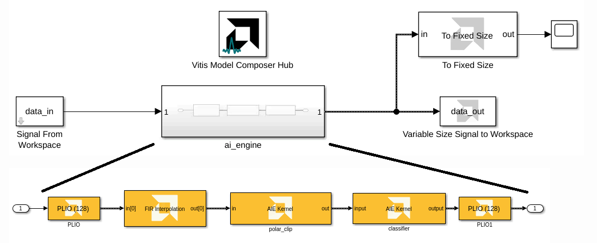

This model implements the AI Engine processing cascade using a FIR Interpolation block from the Vitis DSP Library and AIE Kernel 
blocks pointing to existing kernel source code. The output of simulating the AI Engine processing cascade is 
compared to a reference output. The AI Engine output is also displayed on a scope. 

>**NOTE:** To see how the input and reference output data are loaded into Vitis Model Composer, go to the **Simulink toolstrip -> Modeling -> Model Settings -> Model Properties -> Callbacks -> PostLoadFcn**.

After simulating the processing chain and verifying its functionality, the AI Engine design can be exported to Vitis for integration into a larger project.

## Approach 1: AI Engine Component (Source Code)

### Generate AI Engine Source Code

Vitis Model Composer will generate AI Engine graph code from the design.

1. In the `aie_testbench` model, double-click on the **Vitis Model Composer Hub** block.

2. Ensure that the Hub block is configured as follows for the `ai_engine` subsystem. 

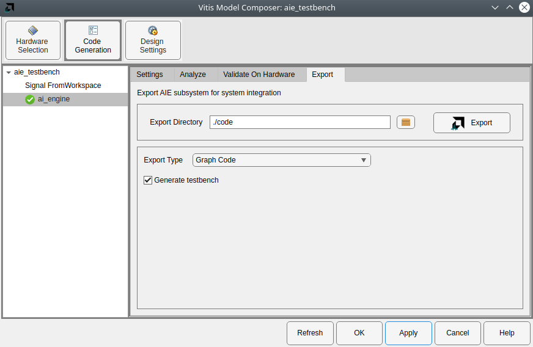

The **Create Testbench** option generates input and reference output data files for the Vitis AIE Simulator, in addition to the graph code.

3. Click **Generate**.

Wait for code generation to complete.


After code generation is complete, explore the contents of the generated `code` folder:

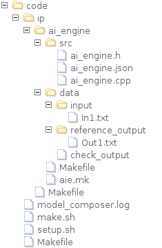

The generated code folder contains a folder called `ip` that contains a subfolder for the AI Engine IP. If this design had HLS IP, `ip` would also contain subfolders for each HLS IP. Each individual IP subfolder contains a `src` folder containing the IP's source code. In this design, the `ip/ai_engine/src` folder contains the AI Engine code we will bring into Vitis as a component. The `ip/ai_engine/data` folder contains input and reference output data files that can be used in AI Engine simulation and hardware validation. Vitis Model Composer also generates Makefiles for compiling and simulating the AI Engine design outside of Model Composer.

### Create AI Engine Component in Vitis

Next, we will create a new Vitis workspace and add an AI Engine component to it.

1. Open a Linux terminal in this lab directory.

2. Configure your shell to run Vitis: `source (path to Xilinx installation)/Vitis/2024.1/settings64.sh`.

3. Start the Vitis IDE: `vitis -w work &`.

This creates a new folder called `work` in the current folder and opens it as a Vitis *workspace*. The Vitis Unified IDE opens to the Welcome page.

4. The Workspace panel on the left side identifies the `work` folder as the current workspace. The workspace is currently empty. Select **Create AI Engine Component**.

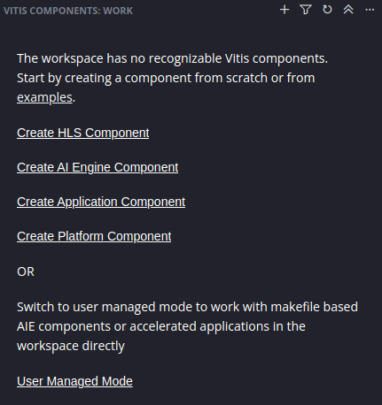

5. Leave the component name and location as their defaults. Click **Next**.


6. Select the **Add Folder** button under Import Sources.


7. Add the `src` folder from the AI Engine IP that you generated from Vitis Model Composer.

8. Repeat the previous step to add the `data` folder from the generated AI Engine IP.

The AI Engine Component must have a top-level file that instantiates and runs the AI Engine graph. Vitis Model Composer generates this file for you as `(subsystem name).cpp` in the `src` folder.

9. Make sure the top-level file is `src/ai_engine.cpp`. Click **Next**.


10. Select a part, platform, or hardware design. In the screenshot below, the VCK190 base platform is selected. Click **Next**.


>**NOTE:** For information on custom platform creation, see *Vitis Platform Creation labs*.

11. On the Summary screen, click **Finish**.

The AI Engine Component is created in the Vitis workspace.


>**NOTE:** If you make changes to the AI Engine design in Vitis Model Composer and re-generate code, update the Vitis component by copying the `data` and `src` folders into the component's folder in the Vitis workspace.

### Configure and Build AI Engine Component

Our AI Engine design in Vitis Model Composer was implemented using custom kernel code and blocks from the Model Composer AI Engine DSP Library. Before building the AI Engine component, it is necessary to add the kernel code's location to the component's include path.

1. Double-click the file `aiecompiler.cfg` in the AI Engine Component.

2. Under Include Directory, click **Add Item**.

3. Add this lab's folder (`07-Export_to_Vitis`) to the include path.

4. Because our AI Engine design contains blocks from the Vitis Model Composer AI Engine DSP library, we must also add the following locations to the include path:
 * `./xmc_aie_lib`
 * `(Model Composer install location)/tps/xf_dsp/L1/src/aie`
 * `(Model Composer install location)/tps/xf_dsp/L1/include/aie`
 * `(Model Composer install location)/tps/xf_dsp/L2/include/aie`

>**NOTE:** The Model Composer install location can be found by typing `xmcPathInfo` in the MATLAB Command Window.


5. To build the AI Engine Component, in the Flow Navigator select **AIE Simulator/Hardware -> Build**.

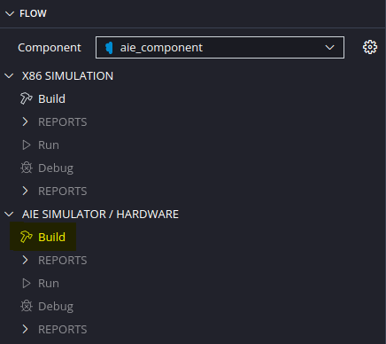

After the build completes, confirm that `Build Finished successfully` appears in the Output console. The build outputs, including the `libadf.a`, are visible in the component workspace.

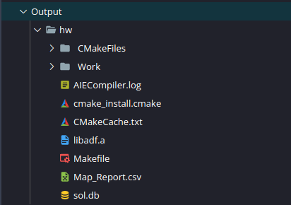

You can now continue working with this component in Vitis, including simulation, debugging, and integrating with other components to build a system project.

## Approach 2: Pre-built Binary

### Generate Compiled AI Engine Graph

In addition to generating AI Engine graph code, Vitis Model Composer can also compile the code into a binary (`libadf.a`) by invoking the `aiecompiler`.

1. In the `aie_testbench` model, double-click on the **Vitis Model Composer Hub** block.

2. Click on the **Hardware Selection** tab.

3. Use the Device Chooser to select a platform file to use for the design. The example below uses the VCK190 base platform.


4. Return to the **Code Generation** tab.

5. Ensure that the Hub block is configured as follows for the `ai_engine` subsystem. 

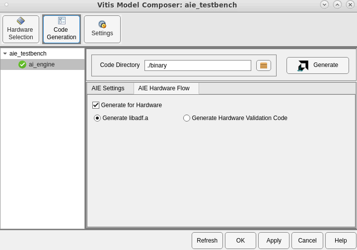

6. Click **Generate**.

Wait for code generation to complete.


After code generation is complete, a report shows what was generated and where it is located:

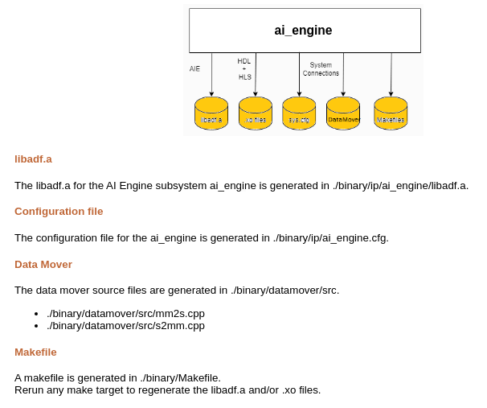

In this lab, we will show how to bring the compiled AI Engine graph (`libadf.a`) into a Vitis system project.

### Create Vitis System Project

First, create an example Vitis system project to use with the rest of this lab.

1. In Vitis, go to the **File menu -> New Component -> System Project**.

2. Leave the project name and location as their defaults. Click **Next**.

3. Select a platform, e.g. VCK190. Click **Next**.

4. Specify the Embedded Component Paths for this system project, then click **Next**.

>Leave the 3 fields (**Kernel Image**, **Root FS**, **Sysroot**) blank to build the system project for a baremetal flow.
>
>Optionally, you can specify the paths to these components to build the system project for Linux. An example is below:
>
>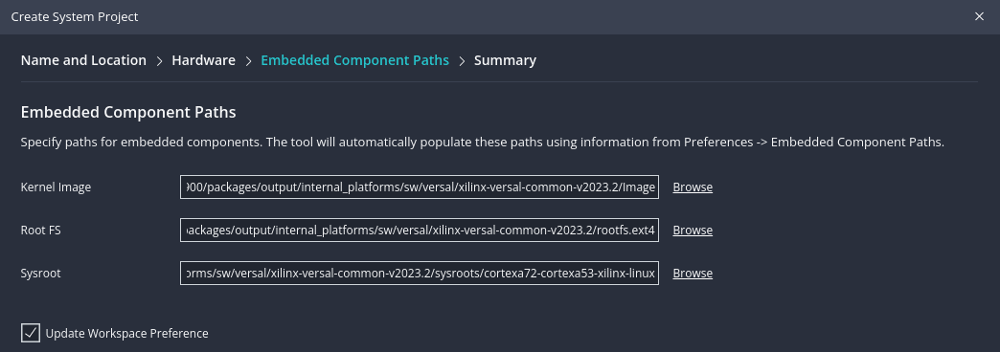

5. Click **Finish**.

The Vitis system project is created in the workspace, and the system project settings open.

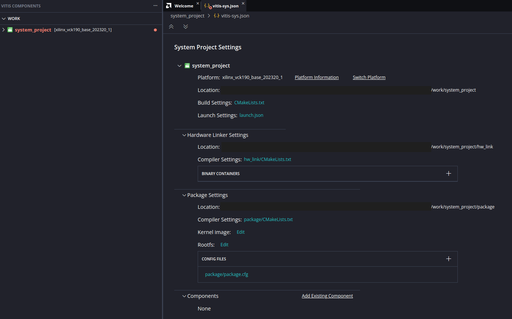

### Add Pre-built Binary

Create a binary container in the system project and add the `libadf.a` generated by Vitis Model Composer to it.

1. Click the **plus sign (+)** next to Binary Containers.

2. Click **OK** to create a new binary container.

3. Next to `binary_container_1`, click on **Add Pre-Built Binary**. Select **AIE Archive**.

4. Navigate to the `libadf.a` created from Vitis Model Composer in the previous section. Click **Open**.

The compiled AI Engine graph is now in the Vitis system project's binary container.

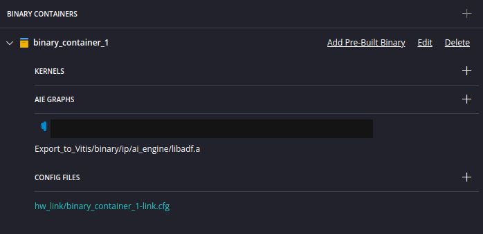

## Next Steps

Now that the AI Engine design has been brought from Vitis Model Composer into Vitis, it can be combined with other PL components (HLS components, data movers, etc.) and a host application to build a complete Versal system design.

To learn more about how to use a Vitis system project, see the [AI Engine/Versal Integration tutorial](https://github.com/Xilinx/Vitis-Tutorials/blob/2024.1/AI_Engine_Development/AIE/Feature_Tutorials/05-AI-engine-versal-integration/unified-ide.md).

## Conclusion

**Congratulations!** This concludes Lab 7 and the AI Engine tutorial series. 

In this lab, we showed two methods (AI Engine Component and pre-built binary) to export an AI Engine design from Vitis Model Composer to a Vitis system project.

---

&copy; Copyright 2024 Advanced Micro Devices, Inc.

Licensed under the Apache License, Version 2.0 (the "License");
you may not use this file except in compliance with the License.
You may obtain a copy of the License at

```
    http://www.apache.org/licenses/LICENSE-2.0
```

Unless required by applicable law or agreed to in writing, software
distributed under the License is distributed on an "AS IS" BASIS,
WITHOUT WARRANTIES OR CONDITIONS OF ANY KIND, either express or implied.
See the License for the specific language governing permissions and
limitations under the License.

<p align="center"><sup>XD058 | &copy; Copyright 2023 Advanced Micro Devices, Inc.</sup></p>

